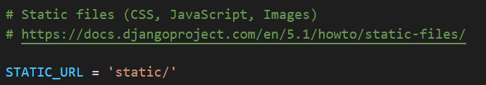
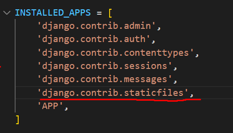
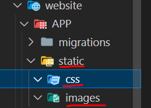
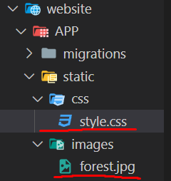
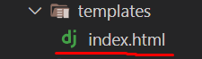
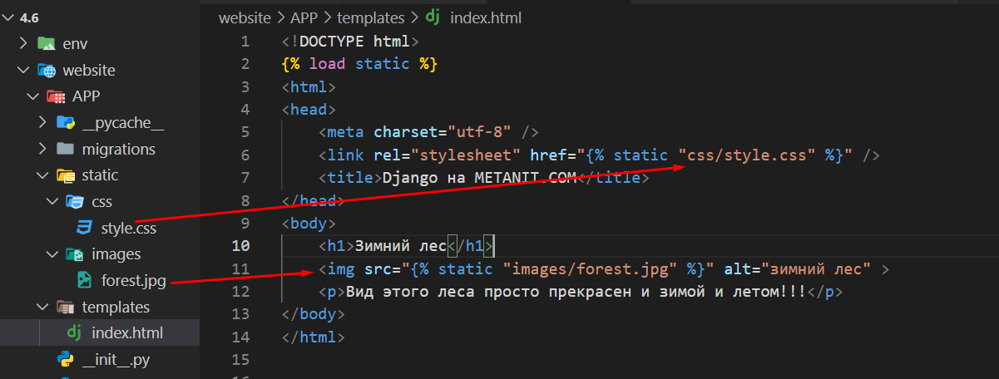
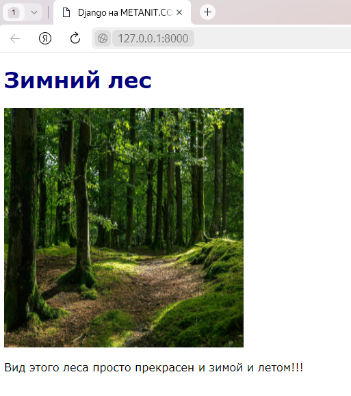

<h1>Вебинар 6</h1>
<h2> Работа с файлами в проекте Django </h2>


<b> staticfiles </b>

Веб-приложение, как правило, использует различные статические файлы - изображения, файлы стилей css, скриптов javascript и так далее. Рассмотрим, как мы можем использовать подобые файлы.
При создании проекта Django он уже имеет некоторую базовую настройку для работы со статическими файлами. В частности, в файле settings.py определена переменная STATIC_URL, которая хранит путь к каталогу со статическими файлами:



А среди установленных приложений в переменной INSTALLED_APPS указано приложение django.contrib.staticfiles



Переменная STATIC_URL имеет значение "static/", а это значит, что нам достаточно создать в папке приложения каталог с именем "static" и добавить в него необходимые нам статические файлы. Но, естественно, при необходимости через данную настройку мы можем изменить расположение каталога статических файлов.

Итак, добавим в папку приложения новый каталог static. Чтобы не сваливать все статические файлы в кучу, определим для каждого типа файлов отдельные папки. В частности, создадим в папке static для изображений каталог images, а для стилей - каталог css. 



Подобным образом можно создавать папки и для других типов файлов.

В папку static/images добавим какое-нибудь изображение - в моем случае это будет файл forest.jpg. 


А в папке static/css определим новый файл styles.css, который будет иметь какие-нибудь простейшие стили, например:

```css
body{ font-family: Verdana;}
h1{color:navy;}
img{width:350px; height: 350px;}
```



Теперь используем эти файлы в шаблоне. Для этого в начале файла шаблона необходимо определить инструкцию
```django

```

При этом данный код должен идти после тега DOCTYPE.
Для определения пути к статическим файлам используются выражения типа

```django

```
Так, пусть в приложении в папке templates определен шаблон index.html, который имеет следующий код:


```django
<!DOCTYPE html>

<html>
<head>
    <meta charset="utf-8" />
    <link rel="stylesheet" href="" />
    <title>Django на METANIT.COM</title>
</head>
<body>
    <h1>Зимний лес</h1>
    
</body>
</html>
```

 

views.py
```py
from django.shortcuts import render

def index(request):
    return render(request, 'index.html')
```

urls.py
```py
from django.urls import path
from APP import views

urlpatterns = [
    path('',views.index,name='index')
]
```

При запуске приложения шаблон index.html будет генерироваться в следующую веб-страницу, которая будет использовать изображение и применять стили:



<b> Настройка путей к файлам </b>

Если нас не устраивает хранение файлов в каталоге по умолчанию - каталоге static, либо мы хотим указать несколько папок, то мы можем в файле settings.py задать все необходимые каталоги с помощью переменной STATICFILES_DIRS, которая принимает список путей:

```py
STATICFILES_DIRS = [
    BASE_DIR / "static",
    "/var/www/static/",
    "/somefolder/"
```

<h2> Формат json </h2>

Данные — это очень важно. Но еще важнее становится умение работать с разнообразными данными. Программистам, разработчикам и ИТ-специалистам необходимо переводить заполненные данными структуры на любом языке в форматы, распознаваемые другими языками и платформами. Это становится возможным с помощью формата обмена данными JavaScript Object Notation (JSON).

JSON стал популярным форматом данных для разработчиков благодаря своему легко читаемому человеком тексту, который очень мало весит, требует меньше кодирования и быстрее обрабатывается.

<h3> Типы данных JSON и примеры </h3>

JSON можно использовать в программах на JavaScript без необходимости разбора или сериализации. Это текстовый способ представления объектных литералов, массивов и скалярных данных JavaScript.

На языке JSON относительно легко читать и писать, а также программному обеспечению на нем просто выполнять задачи разбора и генерации. Он часто используется для сериализации структурированных данных и обмена ими по сети, обычно между сервером и веб-приложениями.
На детализированном уровне JSON состоит из типов данных.

Строка<br>
Число<br>
Логическое выражение<br>
Нуль<br>
Объект<br>
Массив<br>

<b> Строка </b><br>
Строка в JSON состоит из символов Unicode с экранированием обратной косой чертой (\).<br>
Пример<br>
{ "name" : "Jones" }

<b> Число </b><br>
Число JSON соответствует формату JavaScript с плавающей запятой двойной точности.<br>
Пример<br>
{ "number_1" : 210, "number_2" : 215, "number_3" : 21.05, "number_4" : 10.05 }

<b> Логическое выражение </b><br>
'Логические значения выражаются как истина или ложь. Логические значения не заключаются в кавычки и рассматриваются как строковые значения.<br>
Пример<br>
{ "AllowPartialShipment" : false }

<b> Нуль </b> <br>
Нуль — это пустое значение. Если ключу не присваивается значение, он может рассматриваться как нуль.<br>
Пример<br>
{ "Special Instructions" : null }

<b> Объект </b> <br>
Тип данных объекта JSON представляет собой набор пар имен или значений, заключенных между фигурными скобками {}. Ключи должны быть уникальными строками, разделенными запятой.<br>
Пример<br>
{ "Influencer" : { "name" : "Jaxon" , "age" : "42" , "city" , "New York" } }

<b> Массив </b> <br>
Тип данных массива — это упорядоченная коллекция значений. В JSON значения массива должны быть следующих типов: строка, число, объект, массив, логическое выражение или нуль.<br>
Пример<br>
{ "Influencers" : [ { "name" : "Jaxon", "age" : 42, "Works At" : "Tech News" } { "name" : "Miller", "age" : 35 "Works At" : "IT Day" } ] } <br>
Теперь когда мы изучили синтаксис, мы с вами можем заметить что весь синтаксис json очень похож на словари в Python. И для json ответа мы с вами можем воспользоваться функцией JsonResponse.  В качестве json файла мы просто используем словарь Python.

views.py
```py
from django.http import JsonResponse

def json_show(request):
    return JsonResponse({
            'info': {
                'name': 'Petya',
                'lastname': 'Ivanov',
                'age': 16,
            },
            'contacts': {
                'email': 'superpetya@yandex.ru',
                'skype': None,
            },
        })
```

<h2> FileResponse </h2>

Чтобы отправить файл/картинку в качестве ответа в Django, мы можем использовать функцию FileResponse. Создадим папку, назовём её к примеру, files. В эту папку мы с вами добавим 3 картинки. Далее попробуем ответить с помощью одной из них. Для этого создадим views-функцию.

```py
def file_show(request, id):
    return FileResponse(open('APP/files/1.png', 'rb'))
```

У FileReponse так же есть аргументы:<br>
as_attachment=True что бы сделать автозагрузку файла припереходе на страницу.
filename = ‘name.jpg’ - для того что бы переимновать файл для пользователя.

Далее усложним задачу и сделаем возможность выбора файлов и введем ограничения. Если файл существует-файл будет отображен.

views.py
```py
from os import listdir

def file_show(request, id):
    dir = listdir('APP/files')
    if int(id) > len(dir):
        return HttpResponseForbidden()
    elif int(id) == 0:
        return HttpResponseForbidden()
    else:
        return FileResponse(open('APP/images/{id}.png', 'rb'))
```

<h3> Ответ в виде текстового документа. </h3>

Необходимо создать файл file.txt с любым текстом и указать путь к нему.

```py
def download_file(request):
    #Путь к файлу, который вы хотите отправить
    file_path = 'APP/static/text/file.txt'
    
    #Убедитесь, что фаайл существует
    if os.path.exists(file_path):
        #Открываем файл в режиме бинарного чтения
        with open(file_path,'rb',encoding='utf-8') as file:
            #Создаём FileResponse и передаем файл
            response = FileResponse(file)
        #Устанавливаем имя файла, которое будет отображаться при скачивании
        response['Content-Disposition'] = 'attachment'
        return response
    else:
        #Если файл не найден, возвращаем ошибку 404
        return HttpResponseNotFound('File not found')
```
В этом примере `download_file()` является представлением Django. Когда пользователь отправляет запрос на этот URL, он получит в ответ файл `file.txt`, который находится по указанному пути. Название файла для скачивания будет `yourfile.txt`. Если файл не существует, возвращается ошибка 404.

<b> Загрузка изображения </b>
views.py
```py
def download_image(request):
    #Путь к изображению
    image_path = '/APP/static/images/1.png'
    
    #Убедитесь, что изображние существует
    if os.path.exists(image_path):
        with open(image_path,'rb') as image:
            #Создаём FileResponse для отправки изображения
            response = FileResponse(image,content_type = 'image/png')
            #Устанавливаем имя файла, которое будет отображаться при скачивании
            response['Content-Disposition'] = 'attachment'; filename = 'yourimage.png'
            return response
    else:
        return HttpResponseNotFound('Image not found')
```
<h1> Домашнее задание 6. </h1> 
Тема вебинара: Работа с файлами в проекте Django

1) Подключить static-файлы к вашему проекту.

2) Создать CSS оформление для вашего сайта
3) Разместить по 2 картинке на каждой шаблонизированной странице вашего сайта.
4) Создать функцию для отправки картинки в качестве ответа на запрос http://127.0.0.1:8000/picture

<b> Решение: </b>
1) Создана папка static, в которой находятся 2 папки:

-css

-images

2) Создан css дизайн сайта и подключен через static-файлы с помощью link 
(пример)


style.css
```css
body
{ 
    font-family: Verdana;
}
h1
{
    color:navy;
}
img
{
    width:350px; 
    height: 350px;
}
```

views.py
```py
from django.shortcuts import render
from django.http import FileResponse
import os

def pictures(request):
    return FileResponse(open('APP/files/1.png','rb'))
```

urls.py
```py
from django.urls import path
from APP import views

path('',views.index,name='index'),
path('picture/',views.pictures)
```