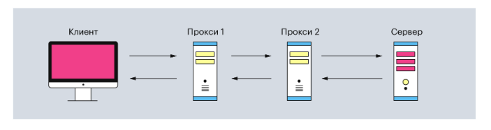
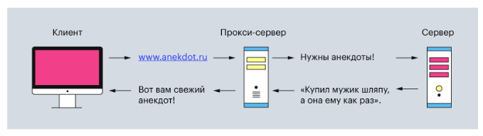
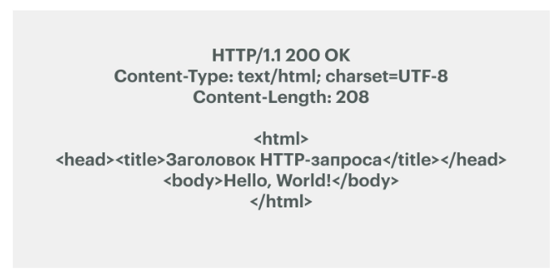
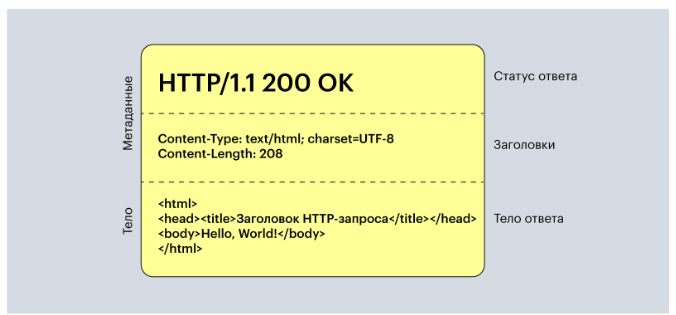
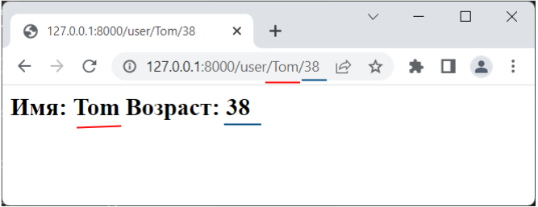
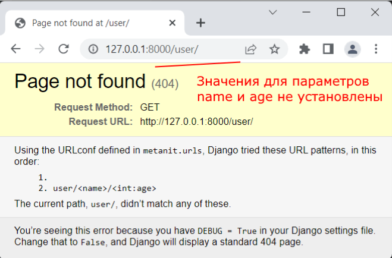
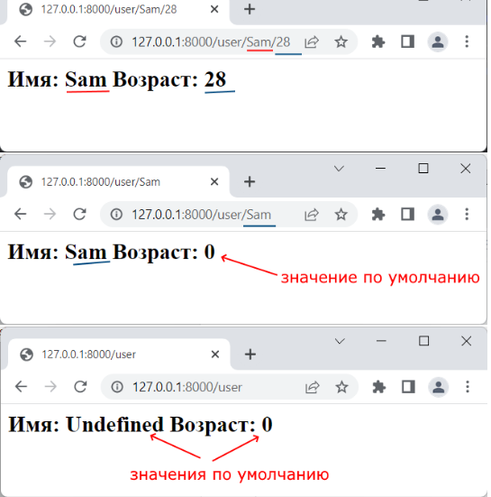
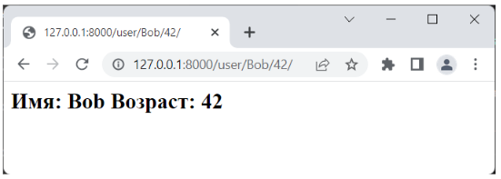

* HTTP означает «протокол передачи гипертекста» (или HyperText Transfer Protocol). Он представляет собой список правил, по которым компьютеры обмениваются данными в интернете. HTTP умеет передавать все возможные форматы файлов — например, видео, аудио, текст. Но при этом состоит только из текста.

    Например, когда вы вписываете в строке браузера yandex.ru, он составляет запрос и отправляет его на сервер, чтобы получить HTML-страницу сайта. Когда сервер обрабатывает запрос, то он отправляет ответ, в котором написано, что всё «ок» и вот вам сайт

* HTTP состоит из двух элементов: клиента и сервера. Клиент отправляет запросы и ждёт данные от сервера. А сервер ждёт, пока ему придёт очередной запрос, обрабатывает его и возвращает ответ клиенту.


* Обычно эта связь между клиентом и сервером имеет посредников в виде прокси-серверов. Они нужны для разных операций — например, для безопасности и конфиденциальности, кэширования или распределения нагрузки на серверы.

Поэтому типичная процедура отправки HTTP-запроса от клиента выглядит так:




В реальной жизни всё сложнее

* Клиентом может быть любое устройство, через которое пользователь запрашивает данные. Часто в роли клиента выступает веб-браузер, программы для отладки приложений или даже командная строка. Главная особенность клиента — он всегда инициирует запрос.

* Сервер — это устройство, которое обрабатывает запросы клиента. Он может состоять как из одного компьютера, так и из кластера. А ещё несколько виртуальных серверов могут находиться на одной физической машине.

* Прокси-серверы — это второстепенные серверы, которые располагаются между клиентом и главным сервером. Они обрабатывают HTTP-запросы, а также ответы на них. Чаще всего прокси-серверы используют для кэширования и сжатия данных, обхода ограничений и анонимных запросов. И ещё — обычно между клиентом и основным сервером находится один или несколько таких прокси-серверов.



Обычное клиент-серверное взаимодействие через прокси-сервер

<b>Как HTTP-протокол работает</b>

Весь процесс передачи HTTP-запроса можно разбить на пять шагов. Давайте разберём их подробнее.

<h3>Шаг первый — вписываем URL в браузер</h3>

* Чтобы отправить HTTP-запрос, нужно использовать URL-адрес — это «унифицированный указатель ресурса» (или Uniform Resource Locator). Он указывает браузеру, что нужно использовать HTTP-протокол, а затем получить файл с этого адреса обратно. Обычно URL-адреса начинаются с http:// или https:// (зависит от версии протокола).

    Например, yandex.ru — это URL-адрес. Он представляет собой главную страницу yandex.ru. Но также в URL-адресе могут быть и поддомены —  https://yandex.ru/images/ Теперь мы запросили главную страницу yandex.ru Кажется, что это выглядит просто: ввели URL-страницы и зашли на сайт

<h3>Шаг второй — браузер находит IP-адрес</h3>

* Для пользователей URL-адрес — это набор понятных слов: Skillbox, Yandex, Google. Но для компьютера эти понятные нам слова — набор непонятных символов.
Поэтому браузер отправляет введённые вами слова в DNS, преобразователь URL-адресов в IP-адреса. DNS расшифровывается как «доменная система имён» (Domain Name System), и его можно представить как огромную таблицу со всеми зарегистрированными именами для сайтов и их IP-адресами.

<h3>Шаг третий — браузер отправляет HTTP-запрос</h3>

* DNS возвращает браузеру IP-адрес, с которым тот уже умеет работать. Теперь браузер начинает составлять HTTP-запрос с вложенным в него IP-адресом.

Сам HTTP-запрос может выглядеть так:


Здесь четыре элемента: метод — «GET», URI — «/», версия HTTP — «1.1» и адрес хоста — «yandex.ru». Давайте разберём каждый из них подробнее.

Метод — это действие, которое клиент ждёт от сервера. Например, отправить ему HTML-страницу сайта или скачать документ. 

Протокол HTTP не ограничивает количество разных методов, но программисты договорились между собой использовать только три основных:

    GET — чтобы получить данные с сервера. Например, видео с YouTube или мем с Reddit. 

    POST — чтобы отправить данные на сервер. Например, сообщение в Telegram или новый трек в SoundCloud. 

    HEAD — чтобы получить только метаданные об HTML-странице сайта. Это те данные, которые находятся в <head>-теге HTML-файла.

URI расшифровывается как «унифицированный идентификатор ресурса» (или Uniform Resource Identifier) — это полный адрес сайта в Сети. Он состоит из двух частей: URL и URN. Первое — это адрес хоста. Например, yandex.ru или www.vk.com. Второе — это то, что ставится после URL и символа 

Версия HTTP указывает, какую версию HTTP браузер использует при отправке запроса. Если её не указывать, по умолчанию будет стоять версия 1.1. Она нужна, чтобы сервер вернул HTTP-ответ с той же версией HTTP-протокола и не создал ошибок с чтением у клиента.

Адрес хоста нужен, чтобы указать, с какого сайта клиент пытается получить данные. Адрес указывают в виде домена, но он сразу же меняется на IP-адрес перед отправкой запроса с помощью DNS.

<h3>Шаг четвёртый — сервер отдаёт HTTP-ответ</h3>

* После получения и обработки HTTP-запроса сервер создаёт ответ и отправляет его обратно клиенту. В нём содержатся дополнительная информация (метаданные) и запрашиваемые данные.

    Простой HTTP-ответ выглядит так:

    

Здесь три главные части: статус ответа — HTTP/1.1 200 OK, заголовки Content-Type и Content-Length и тело ответа — HTML-код. Рассмотрим их подробнее.


Статус ответа содержит версию HTTP-протокола, который клиент указал в HTTP-запросе. А после неё идёт код статуса ответа — 200, что означает успешное получение данных. Затем — словесное описание статуса ответа: «ок».


Всего статусов в спецификации HTTP 1.1 — 40. Вот самые популярные из них:

200 OK — данные успешно получены;

201 Created — значит, что запрос успешный, а данные созданы. Его используют, чтобы подтверждать успех запросов PUT или POST;

300 Moved Permanently — указывает, что URL-адрес изменили навсегда;

400 Bad Request — означает неверно сформированный запрос. Обычно это случается в связке с запросами POST и PUT, когда данные не прошли проверку или представлены в неправильном формате;

401 Unauthorized — нужно выполнить аутентификацию перед тем, как запрашивать доступ к ресурсу;

404 Not Found — значит, что не удалось найти запрашиваемый ресурс;

405 Forbidden — говорит, что указанный метод HTTP не поддерживается для запрашиваемого ресурса;

409 Conflict — произошёл конфликт. Например, когда клиент хочет создать дважды данные с помощью запроса PUT;

500 Internal Server Error — означает ошибку со стороны сервера.

Заголовки помогают браузеру разобраться с полученными данными и представить их в правильном виде. Например, заголовок Content-Type сообщает, какой формат файла пришёл и какие у него дополнительные параметры, а Content-Length — сколько места в байтах занимает этот файл.

Тело ответа содержит в себе сам файл. Например, сервер может вернуть код HTML-документа или отправить JPEG-картинку.



Обычная структура HTTP-ответа

<h3> Шаг пятый — браузер отображает веб-страницу </h3>

* Как только браузер получил ответ с веб-страницей, он отображает её с помощью внутреннего движка. И на этом весь процесс отправки и получение HTTP-запросов заканчивается, а клиент получает нужные ему данные.

<h2>Вложенные маршруты и функция include </h2>

Функция include() позволяет определить вложенные маршруты или подмаршруты для некоторого маршрута. В качестве параметра она принимает набор маршрутов:

```py
include(pattern_list)
```

Параметр pattern_list представляет набор вызовов функций path() и/или re_path(). Например, определим в файле views.py следующие функции:
```py
from django.http import HttpResponse
 
def index(request):
    return HttpResponse("Главная страница")
 
def products(request):
    return HttpResponse("Список товаров")
 
def new(request):
    return HttpResponse("Новые товары")

def top(request):
    return HttpResponse("Наиболее популярные товары")

```

Здесь последние три функции функционально относятся к товарам.

И определим в файле urls.py следующие маршруты:

```py
from django.urls import path, include # добавляем инклуд
from APP import views #Из созданного ранее приложения(APP) импортируем все функции которые там созданы
  
product_patterns = [
    path("", views.products),
    path("new", views.new),
    path("top", views.top),
]
 
urlpatterns = [
    path("", views.index),
    path("products/", include(product_patterns)),
]
```

Здесь в виде переменной product_patterns отдельно определен набор маршрутов, который касается товаров.

Для установки этих маршрутов этот список передается в функцию include()

Причем этот список будет ассоциирован с шаблоном "product". В этом случае шаблоны вложенных маршрутов будут объединены с шаблоном родительского маршрута, и таким образом будет сформирован общий шаблон, которому должен соответствовать запрос.

Например, если придет запрос "http://127.0.0.1:8000/products/top", то он будет обрабатываться функцией top.

Вложенные маршруты получают параметры, определенные в родительских маршрутах. Например, определим в файле views.py следующие функции-представления:

```py
from django.http import HttpResponse
 
def index(request):
    return HttpResponse("Главная страница")
 
def products(request, id):
    return HttpResponse(f"Товар {id}")
 
def comments(request, id):
    return HttpResponse(f"Комментарии о товаре {id}")
 
def questions(request, id):
    return HttpResponse(f"Вопросы о товаре {id}")

```

Здесь все функции кроме первой имеют второй параметр - id - условный номер товара.

Изменим файл urls.py:

```py
from django.urls import path, include
from app import views
 
product_patterns = [
    path("", views.products),
    path("comments", views.comments),
    path("questions", views.questions),
]
 
urlpatterns = [
    path("", views.index),
    path("products/<int:id>/", include(product_patterns)),
]
```

Здесь для второго маршрута определяется числовой параметр id. Этот параметр передается всем вложенным маршрутам, соответственно нам не надо определять данный параметр во вложенных маршрутах

<h2>Параметры представлений</h2>

Функции-представления могут принимать параметры, через которые могут передаваться различные данные. Подобные параметры передаются в адресе URL. Например, в запросе

http://127.0.0.1:8000/index/Tom/38/

последние два сегмента Tom/38/ могут представлять параметры URL, которые могут быть связанны с параметрами функции-представления через систему маршрутизации. Подобные параметры еще можно назвать параметрами маршрута
Определение параметров через функцию path
Определим в файле views.py следующие функции:
```py
from django.http import HttpResponse
   
def index(request):
    return HttpResponse("<h2>Главная</h2>")
  
def user(request, name):
    return HttpResponse(f"<h2>Имя: {name}</h2>")
```

В данном случае функция user имеет два параметра. Для второго параметра - name мы будем получать данные из строки запроса. То есть это будет параметр маршрута. И как любой другой параметр мы сможем использовать его внутри функции.

Далее в файле urls.py определим следующий код:

```py
from django.urls import path
from hello import views
  
urlpatterns = [
    path("", views.index),
    path("user/<str:name>", views.user),
]
```

Для второго маршрута здесь определен параметр name (который соответствует параметру name функции views.user). Параметры заключаются в угловые скобки в формате <спецификатор:название_параметра>. Например, здесь параметр name имеет спецификатор str.

По умолчанию Django предоставляет следующие спецификаторы:

str: соответствует любой строке за исключенем символа "/". Если спецификатор не указан, то используется по умолчанию

int: соответствует любому положительному числу

slug: соответствует последовательности буквенных символов ASCII, цифр, дефиса и символа подчеркивания, например, building-your-1st-django-site
uuid: сооветствует идентификатору UUID, например, 075194d3-6885-417e-a8a8-6c931e272f00

path: соответствует любой строке, которая также может включать символ "/" в отличие от спецификатора str

Также отмечу, что количество и название параметров в шаблонах адресов URL соответствуют количеству и названиям параметров соответствующих функций, которые обрабатывают запросы по данным адресам.

Запустим приложение, обратимся к функции views.user, например, с помошью запроса http://127.0.0.1:8000/user/Tom, и через строку запроса - через ее третий сегмент мы сможем передать значение для параметра name

Подобным образом можно определить и большее количество параметров. Например, добавим второй параметр в функцию user в views.py:

```py
from django.http import HttpResponse
   
def index(request):
    return HttpResponse("<h2>Главная</h2>")
  
def user(request, name, age):
    return HttpResponse(f"<h2>Имя: {name}  Возраст:{age}</h2>")
```

```py
А в файле urls.py добавим в маршрут параметр age:

from django.urls import path
from hello import views
  
urlpatterns = [
    path("", views.index),
    path("user/<name>/<int:age>", views.user),
]

```
Предполагается, что параметр age будет представлять число, поэтому для него используется спецификатор int. В этом случае мы можем обратиться к функции user, например, с помощью запроса
```
http://127.0.0.1:8000/user/Tom/38
```

В этом случае сегмент "/Tom/" будет сопоставлен с параметром name, а "/38" - с параметром age.



<b> Значения для параметров по умолчанию </b>

В примере выше использовались два параметра, но что, если мы не передадим для одного или обоих параметров значения?



В этом случае мы получим ошибку. Параметры маршрута являются частью шаблона URL. Соответственно если в строке запроса не передаются значения для параметров, такой запрос не соответствует маршруту. Поэтому Django не сможет найти нужный маршрут для обработки запроса, и мы получим ошибку 404 (ресурс не найден).

Однако такое поведение не всегда может быть желательным. И мы можем задать для параметров маршрута значения по умолчанию на случай, если через строку запроса не передаются значения. Так, для функции user в views.py определим значения для параметров по умолчанию:

```py
from django.http import HttpResponse
   
def index(request):
    return HttpResponse("<h2>Главная</h2>")
  
def user(request, name="Undefined", age =0):
    return HttpResponse(f"<h2>Имя: {name}  Возраст: {age}</h2>")
```

В данном случае, если для параметра name не передается значение, то он получает в качестве значения строку "Undefined". Для параметра age значение по умолчанию 0.

В этом случае для функции user в файле urls.py надо определить дополнительные маршруты, которые не учитывают необязательные параметры:

```py
from django.urls import path
from hello import views
  
urlpatterns = [
    path("", views.index),
    path("user", views.user),
    path("user/<name>", views.user),
    path("user/<name>/<int:age>", views.user),
]
```


<b>Определение параметров через функцию re_path</b>

Подобным образом мы можем использовать функцию re_path для определения параметров. Определим в приложении в файле views.py следующие функции:

```py
from django.http import HttpResponse
   
def index(request):
    return HttpResponse("<h2>Главная</h2>")
  
def user(request, name, age):
    return HttpResponse(f"<h2>Имя: {name}  Возраст: {age}</h2>")
```
Теперь изменим файл urls.py, чтобы он мог сопоставить данные функции с запросами:

```py

from django.urls import path, re_path
from hello import views
  
urlpatterns = [
    path("", views.index),
    re_path(r"^user/(?P<name>\D+)/(?P<age>\d+)", views.user),
]
```

Для представления параметра в шаблоне адреса используется выражение ?P<>. Общее определение параметру соответствует формату (?P<имя_параметра>регулярное_выражение). Между угловыми скобками помещается название параметра. После закрывающей угловой скобки идет регулярное выражение, которому дожно соответствовать значение параметра.

Во втором шаблоне адреса определяются два параметра: name и age. При этом параметр age должен представлять число, а параметр name должен состоять только из буквенных символов.



Также мы можем указать для определенных параметров значения по умолчанию:
```py
def user(request, name="Undefined", age =0):
    return HttpResponse(f"<h2>Имя: {name}  Возраст: {age}</h2>")
```

В этом случае надо дополнительно определить еще маршруты в файле urls.py для тех запросов, в которых не передаются значения для маршрутов:
```py
from django.urls import path, re_path
from hello import views
  
urlpatterns = [
    path("", views.index),
    re_path(r"^user/(?P<name>\D+)/(?P<age>\d+)", views.user),
    re_path(r"^user/(?P<name>\D+)", views.user),
    re_path(r"^user", views.user),
]
```

Обратите внимание на порядок размещения маршрутов: в отличие от случая с функцией path теперь сначала размещаются более конкретные маршруты с большим количеством параметров.

<b>Функция redirect()</b>

В Django подобные редиректы достаточно просто выполняются с помощью функции:
django.shortcuts.redirect

Давайте для примера сделаем перенаправление со страницы архива, если год больше 2023(views.py):

```py
from django.shortcuts import render,redirect

def archive(request, year):
    if year > 2023:
        return redirect('/')
    return HttpResponse(f"<h1>Архив по годам</h1><p >{year}</p>")
```
И изменим urls.py:
```py
from django.urls import path
from APP import views 

urlpatterns = [
    path("", views.index),
    path('archive/<int:year>',views.archive,name='archive')
]
```
Здесь в качестве первого параметра указывается страница, на которую происходит перенаправление, в данном случае – это главная страница сайта. Также в файле settings.py вернем прежнее значение параметра DEBUG:
```
DEBUG = True
```

Если теперь выполнить запрос:
```
127.0.0.1:8000/archive/2024/
```
то мы попадем на главную страницу с кодом перенаправления 302 (см. консоль). Если же нам нужно указать постоянный редирект с кодом 301, то записывается дополнительный параметр:
```py
return redirect('/', permanent=True)
```

Вообще в качестве первого аргумента функции redirect() можно передавать не только конкретный URL, но и представление. В частности, вместо '/' можно передать ссылку на функцию index следующим образом:
```py
return redirect(index, permanent=True)
```
В данном случае это будет одно и то же.

<b>Классы HttpResponseRedirect и HttpResponsePermanentRedirect</b>

Фреймворк Django дополнительно поддерживает классы для выполнения перенаправлений. В частности имеются два класса:

HttpResponseRedirect – для редиректа с кодом 302;

HttpResponsePermanentRedirect – для редиректа с кодом 301

которые можно использовать вместо функции redirect() следующим образом:
```py
def archive(request, year):
	if year > 2023:
    	return HttpResponseRedirect('/')
 
	return HttpResponse(f"<h1>Архив по годам</h1><p >{year}</p>")
```
На самом деле функция redirect() использует в своей работе эти классы, но, вместе с тем, она несколько более гибкая. Поэтому какой вариант выбирать решает сам программист, исходя из логики построения кода.

<b>Параметр name функции path</b>

Однако указывать в функции redirect, да и вообще где бы то ни было в приложении конкретный URL-адрес (кроме их списка в коллекции urlpatterns) – это порочная практика, или, как еще говорят – хардкодинг. Вместо этого каждому шаблону пути можно присвоить свое уникальное имя и использовать его в рамках всего проекта.

Давайте определим имена для наших URL-запросов. Для этого перейдем в файл website/urls.py и в каждой функции path пропишем параметр name с уникальными именами:
```py
urlpatterns = [
	path('', views.index, name='home'),
	path('cats/<slug:cat_slug>/', views.categories_by_slug, name='cats'),
	path('cats/<int:cat_id>/', views.categories, name='cats_id'),
	re_path(r'^archive/(?P<year>[0-9]{4})/', views.archive, name='archive'),
]

```
Конечно, эти имена вы можете выбрать и другие – это лишь пример. И далее, в функции redirect мы можем выполнить перенаправление на главную страницу, указав имя home:
```py
return redirect('home', permanent=True)
```
Как видите, это гораздо понятнее и безопаснее использования конкретных URL-адресов. Если в дальнейшем маршрут изменится, то автоматически изменится и адрес перенаправления для home.

<b> Функция reverse() </b>

Если же маршрут помимо имени содержит еще параметры, как например, маршрут ‘cats’ с параметром slug, то для корректного перенаправления необходимо в функции redirect() вторым и последующими аргументами передать требуемые параметры. В нашем случае это можно сделать так:
```py
return redirect('cats', 'music')
```
В результате, функция redirect() вычислит следующий URL:
http://127.0.0.1:8000/cats/music/
и сделает на него перенаправление.

Но мы можем разделить операции вычисления URL и непосредственно перенаправление. Для этого в Django имеется функция:
```
django.urls.reverse()
```
которая возвращает строку URL-адреса, вычисленный на основе переданного имени и набора аргументов. Например, для вычисления адреса маршрута cats с параметром ‘music’ функцию reverse() можно вызвать следующим образом:
```
url_redirect = reverse('cats', args=('music', ))
А, затем, передать этот маршрут в функцию reverse():
return redirect(url_redirect)
```

или в соответствующий класс:
```
return HttpResponsePermanentRedirect(url_redirect)
```
На этом мы завершим введение в тему маршрутизации и обработки URL-адресов в Django. Конечно, это лишь базовые возможности, которые предлагает данный фреймворк. Но эта база позволит вам сделать первые шаги в создании сайтов, постепенно знакомясь с другими возможностями Django, опираясь на его документацию или опыт других разработчиков. Рассказать обо всем в рамках начального курса просто нереально. Иначе это превратится в справочную информацию и большого эффекта от такого курса уже не будет.

`FileResponse` - это класс в Django, который предоставляет возможность возвращать файлы клиенту в виде HTTP-ответа. Он может быть использован для отправки файлов различных типов, таких как изображения, документы, аудио и т. д.

<h3>FileReponce</h3>
Данная функция позволяет отправлять файлы в качестве ответов.

1. Удобство использования: `FileResponse` позволяет легко отправлять файлы клиенту без необходимости вручную настраивать HTTP-ответ.

2. Управление заголовками: Вы можете настраивать различные заголовки HTTP-ответа, такие как Content-Disposition, Content-Type и другие, для определения того, как файл должен быть обработан клиентом.

3. Поддержка больших файлов: `FileResponse` обрабатывает большие файлы эффективно благодаря передаче файлов по частям (chunked transfer encoding), что позволяет экономить память сервера при передаче больших файлов.

4. Потоковая передача: Он поддерживает потоковую передачу файлов, что означает, что файл не обязательно должен быть целиком загружен в память сервера перед отправкой.

5. Поддержка диапазонов: `FileResponse` автоматически поддерживает диапазоны HTTP, что позволяет клиентам запросить только определенные части файла, если это необходимо.

В общем, `FileResponse` - это удобный и эффективный способ отправки файлов с помощью Django, который обеспечивает надежную и гибкую работу с файлами в веб-приложениях.

<b> Пример использования </b>

<b> views.py </b>

```py
from django.http import FileResponse
import os

def download_image(request):
    image_path = '/path/to/your/image.jpg'  # Путь к вашему изображению
    return FileResponse(open(image_path, 'rb'), content_type='image/jpeg')
```
<b>Пример отправки pdf (views.py) </b>
```py
from django.http import FileResponse
import os

def download_document(request):
    doc_path = '/path/to/your/document.pdf'  # Путь к вашему документу
    return FileResponse(open(doc_path, 'rb'), content_type='application/pdf')
```
urls.py
```py
from django.urls import path
from .views import download_image, download_document
 
urlpatterns = [
    path('image/', download_image),
    path('document/', download_document),
]

```

<h1>Home Work</h1>

Домашнее задание принимается в виде zip-архива с файлами проекта без виртуальной среды.
1) Создать  2 функции, которые будут выдавать пользователю 2 любых фразы.
 
2) Создать вложенный путь к каждой из них:
Пример:
http://127.0.0.1:8000/pages/page1
http://127.0.0.1:8000/pages/page2

В views.py добавим следующие функции:

```py
from django.http import HttpResponse

def get_phrase1(requset):
    return HttpResponse('Первая фраза, которую выдаёт функция')
def get_phrase2(requset):
    return HttpResponse('Вторая фраза, которую выдаёт функция')
```
После в urls.py зададим маршруты:

```py
from django.urls import path
from APP.views import *

urlpatterns = [
    path('pages/page1',get_phrase1,name='phrase1'),
    path('pages/page2',get_phrase2,name='phrase2'),
]
```

<h1>Домашка с прикольчиком </h1>
views:

```py
from django.shortcuts import render,redirect
from django.http import HttpResponse

def get_phrase1(requset):
    a = '''<a href = "http://127.0.0.1:8000/pages/page2">Первая фраза, которую выдаёт функция</a>
            <a href = "http://127.0.0.1:8000">Вернуться на главную страницу</a>'''
    return HttpResponse(a)
def get_phrase2(requset):
    a = '''<a href = "http://127.0.0.1:8000/pages/page1">Вторая фраза, которую выдаёт функция</a>
            <a href = "http://127.0.0.1:8000">Вернуться на главную страницу</a>'''
    return HttpResponse(a)
def just_prikol(requset):
    prikol = """<h1>Я вас приветствую на странице по Домашнему заданию!</h1>

<a href="http://127.0.0.1:8000/pages/page1">Первая страничка с фразой</a>
<a href="http://127.0.0.1:8000/pages/page2">Вторая страничка с фразой</a>
<p>Задание выполнено. При возникновении вопросов, пожалуйста воздержитесь и просто поставьте высший балл.</p> 
    """
    return HttpResponse(prikol)
```

urls.py:
```py
from django.contrib import admin
from django.urls import path
from APP.views import *

urlpatterns = [
    path('',just_prikol),
    path('pages/page1',get_phrase1,name='phrase1'),
    path('pages/page2',get_phrase2,name='phrase2'),
]
```

