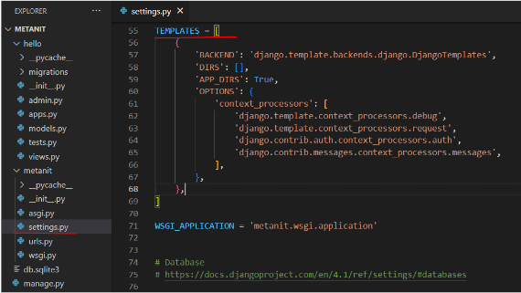
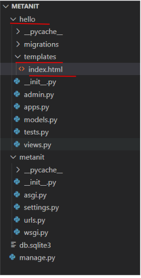
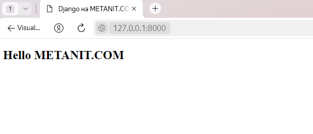

Шаблоны (templates) отвечают за формирование внешнего вида приложения. Они предоставляют специальный синтаксис, который позволяет внедрять данные в код HTML.

Допустим, у нас есть проект metanit, и в нем определено одно приложение - hello:



Настройка функциональности шаблонов в проекте Django производится в файле settings.py. с помощью переменной TEMPLATES. Так, по умолчанию переменная TEMPLATES в файле settings.py имеет следующее определение:

```py
TEMPLATES = [
    {
        'BACKEND': 'django.template.backends.django.DjangoTemplates',
        'DIRS': [],
        'APP_DIRS': True,
        'OPTIONS': {
            'context_processors': [
                'django.template.context_processors.debug',
                'django.template.context_processors.request',
                'django.contrib.auth.context_processors.auth',
                'django.contrib.messages.context_processors.messages',
            ],
        },
    },
]
```

Данная переменная принимает список конфигураций для каждого движка шаблонов. По умолчанию определена одна конфигурация, которая имеет следующшие параметры:

* BACKEND: движок шаблонов. По умолчанию применяется встроенный движок django.template.backends.django.DjangoTemplates
* DIRS: определяет список каталогов, где движок шаблонов будет искать файлы шаблонов. По умолчанию пустой список
* APP_DIRS: указывает, будет ли движок шаблонов искать шаблоны внутри папок приложений в папке templates.
* OPTIONS: определяет дополнительный список параметров

Итак, в конфигурации по умолчанию параметр APP_DIRS имеет значение True, а это значит, что движок шаблонов будет также искать нужные файлы шаблонов в папке приложения в каталоге templates. То есть по умолчанию мы уже имеем настроенную конфигурацию, готовую к использованию шаблонов. Теперь определим сами шаблоны.
Добавим в папку приложения каталог templates. А в нем определим файл index.html:



Далее в файле index.html определим следующий код:

```html
<!DOCTYPE html>
<html>
<head>
    <title>Django на METANIT.COM</title>
    <meta charset="utf-8" />
</head>
<body>
    <h2>Hello METANIT.COM</h2>
</body>
</html>
```

По сути это обычная веб-страница, которая содержит код html. Теперь используем эту страницу для отправки ответа пользователю. И для этого перейдем в приложении APP к файлу views.py, который определяет функции для обработки запроса. Изменим этот файл следующим образом:

```py
from django.shortcuts import render
 
def index(request):
    return render(request, "index.html")
```
Из модуля django.shortcuts импортируется функция render.

Функция index вызывает функцию render, которой передаются объект запроса request и путь к файлу шаблона в рамках папки templates - "index.html".
В файле urls.py проекта пропишем сопоставление функции index с запросом к корню веб-приложения:

```py
from django.urls import path
from hello import views
 
urlpatterns = [
    path("", views.index),
```

И запустим проект на выполнение и перейдем к приложению в браузере (если проект запущен, то его надо перезапустить):



Подобным образом можно указать и другие шаблоны. Например, в папку templates добавим еще две страницы: about.html и contact.html

И также в файле views.py определим функции, которые используют данные шаблоны:

```py
from django.shortcuts import render
 
def index(request):
    return render(request, "index.html")
 
def about(request):
    return render(request, "about.html")
 
def contact(request):
    return render(request, "contact.html")
```

А в файле urls.py свяжем функции с маршрутами:

```py
from django.urls import path
from hello import views
 
urlpatterns = [
    path("", views.index),
    path("about/", views.about),
    path("contact/", views.contact),
]
```

TemplateResponse

Выше для генерации шаблона применялась функция render(), которая является наиболее распространенным вариантом. Однако также мы можем использовать класс TemplateResponse:

```py

from django.template.response import TemplateResponse
  
def index(request):
    return TemplateResponse(request,  "index.html")

```

Результат будет тот же самый.

<b>Шаблонизатор</b>

Шаблонизатор в Django - это часть фреймворка, которая используется для генерации динамического HTML-кода на основе данных из вашего приложения. Он позволяет вам разделять логику приложения и представление, что улучшает читаемость кода и облегчает совместную работу разработчиков и дизайнеров.

Основные характеристики и возможности шаблонизатора в Django:

1) Синтаксис: Django использует собственный синтаксис для шаблонов, который основан на языке разметки HTML, но содержит дополнительные конструкции и фильтры для работы с данными и логикой.

2) Вставка данных: В шаблонах Django вы можете вставлять данные из контекста (контекст - это набор данных, переданных в шаблон из представления) с помощью двойных фигурных скобок {{ переменная }}. Это позволяет выводить переменные, значения которых вы передали из представления.

3) Условные операторы и циклы: Шаблонизатор Django позволяет использовать условные операторы (например,  ... ) и циклы (например,  ... ), что позволяет вам создавать динамические итерации и ветвления в вашем HTML-коде.

4) Включение других шаблонов: Вы можете создавать многоразовые части вашего HTML-кода и включать их в другие шаблоны с помощью .

5) Наследование шаблонов: Django поддерживает механизм наследования шаблонов. Вы можете создавать базовые шаблоны, которые определяют общий макет страницы, и затем расширять их для создания конкретных страниц, переопределяя блоки контента.

6) Фильтры: Шаблонизатор Django предоставляет множество встроенных фильтров, которые позволяют вам форматировать и изменять данные, прежде чем они будут выведены на страницу.

7) Безопасность: Django по умолчанию предоставляет средства защиты от уязвимостей, таких как XSS (межсайтовый скриптинг), благодаря автоматической фильтрации выводимых данных.

8) Пользовательские теги и фильтры: Вы можете создавать собственные пользовательские теги и фильтры, чтобы расширить функциональность шаблонизатора Django под свои нужды.

<b>Jinja</b> использует различные разделители в строках шаблона.
```
 - для выражений или логики (например, для циклов)

{{}} - используется для вывода результатов выражения или переменной конечному пользователю.

{##} - комментарии, которые не включены в выходные данные шаблона

### - операторы строки
```
Возможности шаблонизатора:

1) Интерполяция(вставка) данных. В функции render последним аргументом мы можем передать словарь с любыми данными для вставки в html(render(request, ‘products.html’, {‘products’: list(Product.objects.all())}). Далее эти данные можно будет использовать в шаблонизаторе: {{ products[0].name }}. Также есть возможность применения фильтра избегания html {{ products[0].name || e }}, чтобы не допускать вставки html кода в страницу. А при вставке с помощью {{- products[0].name -}}, вы удалите все пробелы в начале и конце вставляемого текста.

2) Условная отрисовка. Вы можете добавлять условные конструкции в код шаблона: 
```
 
Бесплатно
 
{{ products[0].price }}

```
3) Цикличная отрисовка. Если вам требуется однообразно обработать множество значений, вы можете использовать данную конструкцию:
```
 
<h2> {{ product.name }} </h2>

```

<h2>Ответ в виде HTML-страницы.</h2>

Для отображения HTML-страницы в Django с использованием функции представления (views), вам нужно выполнить следующие шаги:

1. Создайте HTML-шаблон:
   Создайте HTML-файл, который будет представлять вашу страницу. Например, создайте файл `my_template.html`:

```html
<!DOCTYPE html>
<html lang="en">
<head>
    <meta charset="UTF-8">
    <meta name="viewport" content="width=device-width, initial-scale=1.0">
    <title>МОЯ HTML-страница</title>
</head>
<body>
    <h1>Добро пожаловать на мою страницу HTML</h1>
    <p> Простой пример HTML-страницы в Django.</p>
</body>
</html>
```

2. Создайте Django представление (view):
   В вашем Django приложении создайте представление (view), которое будет обрабатывать запрос и возвращать этот HTML-шаблон. Ваш файл `views.py` может выглядеть следующим образом:

```py
from django.shortcuts import render

def my_view(request):
    return render(request, "my_template.html")
```

Здесь мы импортируем функцию `render` из модуля `django.shortcuts` и создаем представление `my_view`, которое просто рендерит HTML-шаблон `my_template.html`.

3. Настройте маршрутизацию:
   Далее, настройте маршрут (URL-путь) для этого представления в файле `urls.py` вашего Django приложения:

```py
from django.contrib import admin
from django.urls import path
from APP import views

urlpatterns = [
    path('my_page/', views.my_view,name='my_page'),
]
```

Здесь мы создаем URL-путь `'my-page/'`, который будет соответствовать представлению `my_view`.

4. Запустите сервер Django:
   Убедитесь, что ваш сервер Django запущен, например, с помощью команды `python manage.py runserver`.

5. Посещение страницы:
   Теперь, когда ваш сервер запущен, вы можете открыть браузер и перейти по адресу `http://localhost:8000/my_page/` (где `my_page/` соответствует URL-пути, который вы настроили в `urls.py`). Вы увидите вашу HTML-страницу, которую отображает представление `my_view`.

   <h2>Создание нескольких HTML-страниц.</h2>

   Создадим с помощью emmit несколько простых HTML-страниц. Это будут страницы с контактами (contacts.html), страница с продуктами (products.html) и страница с информацией о компании (about_us.html).


contacts.html

```html
<!DOCTYPE html>
<html lang="en">
<head>
    <meta charset="UTF-8">
    <meta name="viewport" content="width=device-width, initial-scale=1.0">
    <title>Контакты</title>
</head>
<body>
    <h1>Тут будут наши контакты</h1>
</body>
</html>
```
products.html

```html
<!DOCTYPE html>
<html lang="en">
<head>
    <meta charset="UTF-8">
    <meta name="viewport" content="width=device-width, initial-scale=1.0">
    <title>Продукты</title>
</head>
<body>
    <h1>Тут будут наши продукты</h1>
</body>
</html>
```
main_page.html
```html
<!DOCTYPE html>
<html lang="en">
<head>
    <meta charset="UTF-8">
    <meta name="viewport" content="width=device-width, initial-scale=1.0">
    <title>СТРАНИЦА ВЕЛИКОГО СОЗДАТЕЛЯ</title>
</head>
<body>
    <h1>СТРАНИЦА ВЕЛИКОГО СОЗДАТЕЛЯ</h1>
</body>
</html>
```
about_us.html
```html
<!DOCTYPE html>
<html lang="en">
<head>
    <meta charset="UTF-8">
    <meta name="viewport" content="width=device-width, initial-scale=1.0">
    <title>О компании</title>
</head>
<body>
    <h1>Тут будет информация о компании</h1>
</body>
</html>
```

views.py:
```py
from django.shortcuts import render

def my_view(request):
    return render(request, "my_template.html")

def contacts(request):
    return render(request, 'contacts.html')

def products(request):
    return render(request, 'products.html')

def about_us(request):
    return render(request, 'about_us.html')

def main_page(request):
    return render(request, 'main_page.html')
```

urls.py:
```py
from django.contrib import admin
from django.urls import path
from APP import views

urlpatterns = [
    path('my_page/', views.my_view,name='my_page'),
    path('', views.main_page,name='main_page'),
    path('contacts/', views.contacts,name='contacts'),
    path('products/', views.products,name='products'),
    path('about_us/', views.about_us,name='about_us'),
]
```

<h2>Шаблонизация</h2>

Обратите внимание, как много кода у нас повторяется, из за повторения одного и того же кода мы с вами можем осознать, что это не самое лучшее решение. Давайте воспользуемся шаблонизацией.

Для этого необходимо создать базовый шаблон и разместитьв нем блоки, в которые мы будем передавать код из другихфайлов в последствии.

base.html
```html
<!DOCTYPE html>
<html lang="en">
<head>
    <meta charset="UTF-8">
    <meta name="viewport" content="width=device-width, initial-scale=1.0">
    <title></title>
</head>
<body>
    
    
</body>
</html>
```

Далее нам необходимо удалить лишние блоки, и прописать extends ‘base.html’ в каждом нашем html-файле кроме базового шаблона и просто передать ту информацию, которая должна отображаться в блок title блок content.


<b>Вывод переменных с помощью шаблонизатора</b>

views.py

```py
from django.shortcuts import render

def my_function(request):
    my_varriable = 'Привет, мир!'
    return render(request, "my_template.html", {'my_variable': my_varriable})
```

Шаблон(templates):
```html
<!DOCTYPE html>
<html lang="en">
<head>
    <meta charset="UTF-8">
    <meta name="viewport" content="width=device-width, initial-scale=1.0">
    <title>Моя функция</title>
</head>
<body>
    <h1> {{my_variable}} </h1>
</body>
</html>
```

urls.py:
```py
from django.contrib import admin
from django.urls import path
from APP import views

urlpatterns = [
    path('my_url/', views.my_function,name='my_function'),
]
```

<h1> Домашнее задание 5. </h1>
<b>Тема вебинара: Шаблонизация<b>

1) Создать базовый шаблон страниц сайта

2) Создать 3 различные страницы, основанные на базовом шаблоне
3) На первом шаблоне создать таблицу с помощью HTML с тремя колонками: название, цена, описание и добавить туда 2-3 записи.

base.html
```html
<!DOCTYPE html>
<html lang="en">
<head>
    <meta charset="UTF-8">
    <meta name="viewport" content="width=device-width, initial-scale=1.0">
    <title>  Мой сайт  </title>
</head>
<body>
    <header>
        <h1>Мой сайт</h1>
        <nav>
            <ul>
                <li><a href="/">Главная</a></li>
                <li><a href="/about">О нас</a></li>
                <li><a href="contact">Контакты</a></li>
            </ul>
        </nav>
    </header>

    <main>
        
        
    </main>

    <footer>
        <p>&copy;  2024 Мой сайт </p>
    </footer>
</body>
</html>
```

home.html

```html


 Главная 


<h2>Добро пожаловать!</h2>
<p>Это главняа страница моего сайта. </p>

```

about_us.html

```html


 О нас 


<h2>Информация о нашей компании</h2>
<p>Здес будет информация совсем скоро, просто подождите </p>

```

contacts.html
```html


 Контакты 


<h2>Как с нами связаться</h2>
<p>Адрес: ул. Полупрозрачная, 5-пять </p>
<p>Телефон: +М ДДД ОПЯТЬ ЗАБЫЛ</p>
<p>Email: ne_pishite_plz@sps.net</p>

```

views.py
```py
from django.shortcuts import render

def contacts(request):
    return render(request, 'contacts.html')

def about_us(request):
    return render(request, 'about_us.html')

def main_page(request):
    return render(request, 'home.html')
```