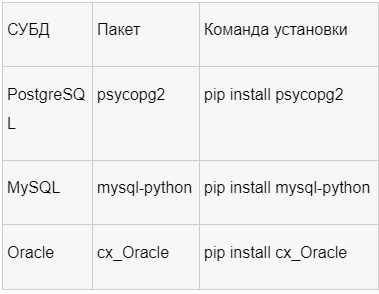
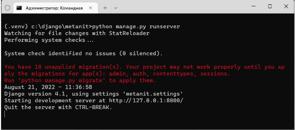
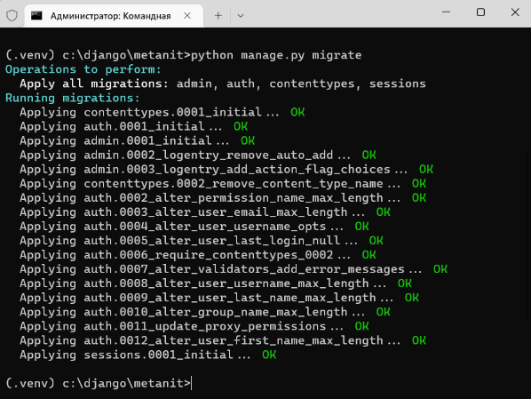
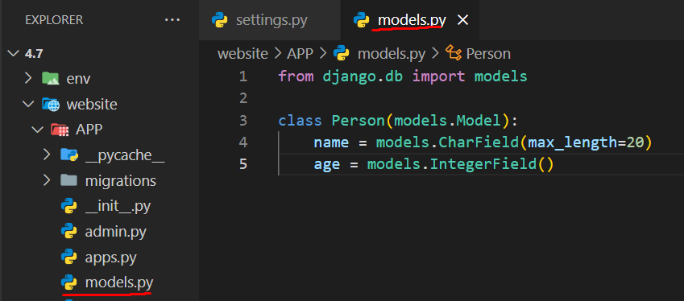

Подключение к базе данных
 
Для хранения данных в веб-приложении, как правило, применются базы данных. И фреймворк Django уже по умолчанию предоставляет удобный функционал для работы с различными системами баз данных.
Настройки подключения к базе данных
По умолчанию Django в качестве базы данных использует SQLite. Она очень проста в использовании и не требует запущенного сервера. Все файлы базы данных могут легко переноситься с одного компьютера на другой. Однако при необходимости мы можем использовать в Django большинство распространенных СУБД.
Для работы с базами данных в проекте Django в файле settings.py определен параметр DATABASES, который по умолчанию выглядит следующим образом:

```py
DATABASES = {
    'default': {
        'ENGINE': 'django.db.backends.sqlite3',
        'NAME': BASE_DIR / 'db.sqlite3',
    }
```

Переменная DATABASES содержит набор конфигураций подключений к базам данных в виде словаря. Ключи в этом словаре - названия подключений. То есть мы можем определить кучу подключений. Но как минимум одно подключение должно быть определено в переменной DATABASES - подключение с именем default, которое представляет подключение по умолчанию.

Конфигурация каждого подключения может состоять из ряда параметров. По умолчанию указываются только два параметра. Параметр ENGINE указывает на используемый движок для доступа к БД. В данном случае это встроенный пакет django.db.backends.sqlite3.

Второй параметр - NAME указывает на путь к базе данных. По умолчанию база данных называется db.sqlite3. Для установки пути используется каталог из переменной BASE_DIR, которая задана в начале файла:

```py
BASE_DIR = Path(__file__).resolve().parent.parent
```

По умолчанию BASE_DIR указывает на каталог, в котором находится папка проекта. И после первого запуска проекта в указанном каталоге по умолчанию будет создан файл db.sqlite3, который собственно и будет использоваться в качестве базы данных.


<b> Поддерживаемые субд </b>

Чтобы использовать другие системы управления базами данных, необходимо будет установить соответствующий пакет.



<b> Параметры подключения </b>

Выше в настройках по умолчанию применялись только два параметра: ENGINE и NAME. Однако при необходимости можно указать и дополнительные параметры:
<br>
ATOMIC_REQUESTS: при значении True обертывает каждый запрос к бд в транзакцию. По умолчанию равно False
AUTOCOMMIT: при значении False отключает систему управления транзакциями Django. По умолчанию равно True
ENGINE: движок бд. Поддерживаются следующие встроенные движки:
django.db.backends.postgresql<br>
django.db.backends.mysql<br>
django.db.backends.sqlite3<br>
django.db.backends.oracle<br>
HOST: хост базы данных<br>
NAME: имя базы данных, для sqlite - путь к бд<br>
CONN_MAX_AGE: время жизни подключения в секундах. Значение 0 закрывает подключение сразу после завершения каждого запроса к бд. А значение None указывает на постоянное подключение. По умолчанию равно 0<br>
CONN_HEALTH_CHECKS: при значении True проверяет активность подключения, и если оно закрыто, заново устанавливает соединение. По умолчанию равно False<br>
OPTIONS: дополнительный набор параметров, который может потребоваться при подключении к определенных базам данных.<br>
PASSWORD: пароль. По умолчанию равно '' (пустая строка)<br>
PORT: порт бд. По умолчанию равно '(пусто)'<br>
TIME_ZONE: часовой пояс. По умолчанию равно None<br>
USER: имя пользователя. По умолчанию равно ''<br>
TEST: набор настроек в виде словаря для теста подключения
Для разных СУБД может потребоваться разный набор параметров. Например, подключение к БД Postgres в общем случае выглядит так:

```json
DATABASES = {
    'default': {
        'ENGINE': 'django.db.backends.postgresql',
        'NAME': 'mydatabase',
        'USER': 'mydatabaseuser',
        'PASSWORD': 'mypassword',
        'HOST': '127.0.0.1',
        'PORT': '5432',
    }
}
```
<b> Миграции базы данных </b> <br>
При создании базы данных она еще пуста, не содержит никаких данных. Однако в консоли при запуске проекта мы можем увидеть некоторое сообщение, выделенное красным цветом:



Дело в том, что для ряда приложений, подключенных в проект по умолчанию, требуется база данных для сохранения некоторых своих данных. Так, в в файле settings.py в переменной INSTALLED_APPS по умолчанию указан ряд приложений
```py
INSTALLED_APPS = [
    'django.contrib.admin',
    'django.contrib.auth',
    'django.contrib.contenttypes',
    'django.contrib.sessions',
    'django.contrib.messages',
    'django.contrib.staticfiles',
    # остальные приложения ......
    # ................
]
```

Первые четыре приложения так или иначе используют базу данных. Однако, чтобы базы данных создала нужные для этих приложений таблицы, необходимо выполнить миграции - специальные скрипты, которые изменяют стуруктуру базы данных. Для этого выполним в консоли команду

```
python manage.py migrate
```



<h2> Создание моделей </h2>

Модели в Django описывают структуру используемых данных. Используемые в программе данные хранятся в базах данных, и с помощью моделей как раз осуществляется взаимодействие с базой данных.<br>
При создании приложения по умолчанию в его каталог добавляется файл models.py, который применяется для определения моделей. Модель представляет класс, унаследованный от django.db.models.Model.<br>
Так, изменим файл models.py следующим образом:

```py
from django.db import models
 
class Person(models.Model):
    name = models.CharField(max_length=20)
    age = models.IntegerField()
```



Здесь определена простейшая модель, которая называется Person и которая представляет человека. В модели определены два поля. Поле name представляет тип CharField - текстовое поле, которое хранит последовательность символов. Оно будет хранить имя человека. Для CharField обязательно надо указать параметр max_length, который задает максимальную длину хранящейся строки. И поле age представляет тип IntegerField - числовое поле, которое хранит целые числа. Оно предназначено для хранения возраста человека. <br>
Каждая модель сопоставляется с определенной таблицей в базе данных. Однако пока у нас нет в бд таблицы, которая хранит объекты модели Person. И в этом случае нам надо создать и выполнить миграцию. Миграция преобразует базу данных в соответствии с определением моделей.<br>
Вначале необходимо создать миграцию с помощью команды

```cmd
python manage.py makemigrations
```


После этого в приложении в папке migrations мы обнаружим новый файл, который будет иметь примерно следующее содержимое:
```py
from django.db import migrations, models
 
 
class Migration(migrations.Migration):
 
    initial = True
 
    dependencies = [
    ]
 
    operations = [
        migrations.CreateModel(
            name='Person',
            fields=[
                ('id', models.BigAutoField(auto_created=True, primary_key=True, serialize=False, verbose_name='ID')),
                ('name', models.CharField(max_length=20)),
                ('age', models.IntegerField()),
            ],
        ),
    ]
```

Это и есть миграция. Здесь можно заметить, что создается не два, а три поля - поле id, которое будет представлять первичный ключ, добавляется по умолчанию. Поэтому в приниципе в самой модели нам не нужно явным образом определять какой-либо идентификатор.


Теперь надо выполнить данную миграцию. Для этого выполняется команда

```
python manage.py migrate
```


<h2> Django Admin Panel </h2>

Для того что бы войти в в админ панель, необходимо создать суперпользователя:

```
python manage.py createsuperuser
```


Далее необходимо заполнить все поля. После этого мы сможем зайти в админку по пути http://127.0.0.1:8000/admin.
Добавим наши модели в панель администратора с помощью файла admin.py 
где зарегистрируем наши модели.
Пример регистрации моделей.


<h2> Что такое SQL </h2>

SQL (Structured Query Language, или язык структурированных запросов) — это декларативный язык программирования (язык запросов), который используют для создания, обработки и хранения данных в реляционных БД. <br>
На чистом SQL нельзя написать программу — он предназначен только для взаимодействия с базами данных: получения, добавления, изменения и удаления информации в них, управления доступом и так далее.<br>
Поэтому перед изучением SQL нужно разобраться, как устроены базы данных.<br>
<b> В каких базах данных используют SQL </b> <br>
Все БД можно поделить на два вида: реляционные и нереляционные. Язык SQL нужен для работы с первыми.<br>
SQL настолько тесно связан с реляционными БД, что все нереляционные БД в противовес стали называть NoSQL. Вот и получилось, что SQL — это язык программирования, а NoSQL — тип баз данных.<br>
Про реляционные БД часто говорят, что это набор двумерных таблиц. Прямо как в Excel: со столбцами, строками и ячейками. Это понятная визуализация, хотя и не совсем точная.<br>
Представим, что мы создаём базу данных для небольшой строительной фирмы. Она проектирует загородные дома и передаёт проекты подрядчикам, которые занимаются самим строительством:


Примерная база данных воображаемой строительной фирмы
Чем же база данных отличается от таблицы? Тем, что в базе:
У столбцов и строк нет определённого положения. Нельзя сказать, что столбец status находится до или после столбца num_floors, а имя Анастасии Романиной — до или после имени Дмитрия Пожарова.

Каждый столбец диктует свой домен, то есть тип данных, к которому могут относиться его значения. Например, в столбцах cost и num_floors могут храниться только числа, а в столбце client — только строки.

Каждая строка должна быть уникальной и не может повторять какую-то другую строку.

Из-за этих отличий применительно к базам данных используют другую терминологию. Столбец называется атрибутом, строка — записью или кортежем, а сама БД — их отношением друг к другу.

Структура sql-запросов (Только теория)
```sql
Общая структура запроса выглядит следующим образом:
SELECT ('столбцы или * для выбора всех столбцов; обязательно')
FROM ('таблица; обязательно')
WHERE ('условие/фильтрация, например, city = 'Moscow'; необязательно')
GROUP BY ('столбец, по которому хотим сгруппировать данные; необязательно')
HAVING ('условие/фильтрация на уровне сгруппированных данных; необязательно')
ORDER BY ('столбец, по которому хотим отсортировать вывод; необязательно')
```

Разберем структуру. Для удобства текущий изучаемый элемент в запроса выделяется CAPS'ом.
SELECT, FROM

SELECT, FROM — обязательные элементы запроса, которые определяют выбранные столбцы, их порядок и источник данных.
Выбрать все (обозначается как *) из таблицы Customers:
```sql
SELECT * FROM Customers
Выбрать столбцы CustomerID, CustomerName из таблицы 

Customers:
SELECT CustomerID, CustomerName FROM Customers
WHERE
```
WHERE — необязательный элемент запроса, который используется, когда нужно отфильтровать данные по нужному условию. Очень часто внутри элемента where используются IN / NOT IN для фильтрации столбца по нескольким значениям, AND / OR для фильтрации таблицы по нескольким столбцам.

<h2> Home Work </h2>

<b> Тема вебинара: Типы Баз данных и работа с SQLite, Admin Panel </b>
```
1) Создать модель категории товаров с полями:
Название категории
Описание категории
2) Создать модель производителя товара c полями:
Название бренда
Описание бренда
3) Выполнить миграцию моделей в БД.
```

Решение: 

models.py
```py
from django.db import models

class Category(models.Model):
    name = models.CharField(max_length=100, unique=True)
    description = models.TextField()
    
    def __str___(self):
        return self.name
    
class Menufacturer(models.Model):
    name = models.CharField(max_length=100, unique=True)
    description = models.TextField()
    
    def __str___(self):
        return self.name
```
В терминале выполним команды:
```
python manage.py makemigrations
```


Далее выполним команду
```
python manage.py migrate
```
