<h1> Формы в Django </h1>

Веб-формы — это страницы, которые пользователи запрашивают с помощью браузера. Эти страницы могут быть написаны с помощью сочетания HTML, клиентского скрипта, серверных элементов управления и серверного кода. Когда пользователи запрашивают страницу, она компилируется и выполняется на сервере платформой, а затем платформа создает HTML-разметку, которую может отобразить браузер.

Django предоставляет класс Form, который используется для создания HTML-форм. Он описывает форму, ее работу и внешний вид. Он похож на класс ModelForm, который создает форму с помощью модели, но не требует определенной модели.

Каждое поле карты класса Form соответствует элементу HTML-формы "input", и каждое из них является самим классом, он управляет данными формы и выполняет проверку при отправке формы.

input -> <input>

Давайте посмотрим на пример, в котором мы тоже создаем несколько полей.

В созданном приложении, создадим(если его нет) файл forms.py
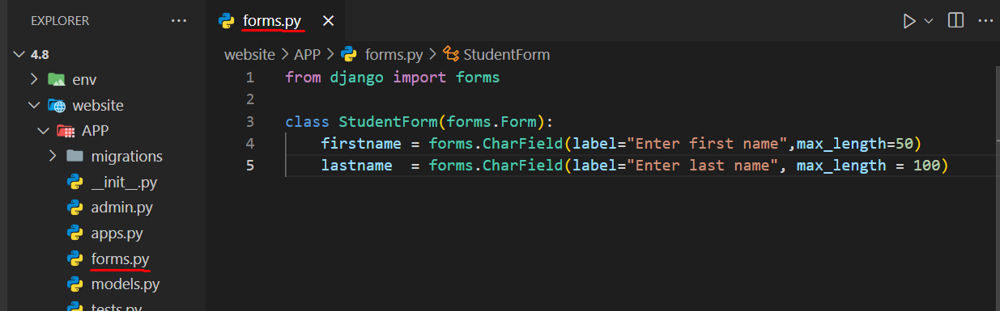

И поместим в него следующий код: 
```py
from django import forms 
class StudentForm(forms.Form): 
    firstname = forms.CharField(label="Enter first name",max_length=50) 
    lastname  = forms.CharField(label="Enter last name", max_length = 100) 
```
Создается StudentForm, содержащий два поля типа CharField. 

Charfield – это класс, который используется для создания компонента ввода текста HTML в форме.

Метка используется для установки HTML-метки компонента, а max_length устанавливает длину входного значения.

При рендеринге он выводит в браузер следующий HTML-код.

```html
<label for="id_firstname">Enter first name:</label> 
<input type="text" name="firstname" required maxlength="50" id="id_firstname" /> 
<label for="id_lastname">Enter last name:</label> <input type="text" name="lastname" required maxlength="100" id="id_lastname" />
```

Примечание. Django Form не включает теги или кнопку отправки. Мы должны сами указать их в шаблоне.

<b> Создание формы в Django </b>
Предположим, мы хотим создать форму для получения информации о студенте, используем для этого следующий код.

```py
from django import forms 
class StudentForm(forms.Form): 
    firstname = forms.CharField(label="Enter first name",max_length=50) 
    lastname  = forms.CharField(label="Enter last name", max_length = 100)
```
Поместите этот код в файл forms.py.

<b> Создание экземпляра формы в Django </b>
Теперь нам нужно создать экземпляр формы в файле views.py. (См. приведенный ниже код).
```py
#views.py
from django.shortcuts import render 
from APP.forms import StudentForm 
 
def index(request): 
    student = StudentForm() 
    return render(request,"index.html",{'form':student}) 

```
И код для html:
```html
// index.html

<!DOCTYPE html> 
<html lang="en"> 
<head> 
<meta charset="UTF-8"> 
<title>Index</title> 
</head> 
<body> 
<form method="POST" class="post-form"> 
 
{{ form.as_p }} 
<button type="submit" class="save btn btn-default">Save</button> 
</form> 
</body> 
</html>   
```
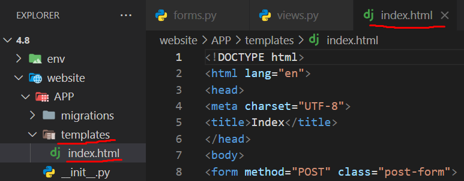

Укажите URL-адрес в urls.py
```py
#urls.py
from django.urls import path
from APP import views

urlpatterns = [
    path('', views.index),
]
```

Запустите сервер и войдите в форму в браузере по адресу localhost: 8000, и он выдаст следующий результат.

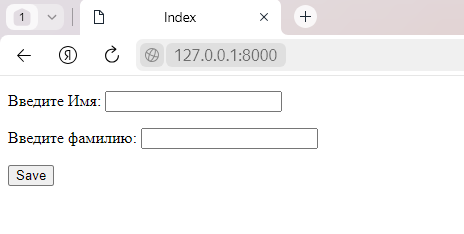

```
Однако есть и другие варианты вывода для пар <label>/<input>:
```

```django
{{form.as_table}} отобразит их как ячейки таблицы, заключенные в теги <tr>;
{{form.as_p}} отобразит их заключенными в теги <p>;
{{form.as_ul}} также отобразит их заключенными в теги <li>.
```

<h2> Создание простой HTML-формы </h2>

Для создания простой HTML-формы с полями "Имя" и "Номер телефона" и представления (views function) для обработки этой формы с методом GET, следуйте этим шагам:

Шаг 1: Создайте файл my_form.html в директории templates вашего Django-приложения. В этом файле создайте форму:

```html
<!DOCTYPE html>
<html lang="en">
<head>
    <meta charset="UTF-8">
    <meta name="viewport" content="width=device-width, initial-scale=1.0">
    <title>Простая HTML-форма</title>
</head>
<body>
    <h1>Простая HTML-форма (GET)</h1>
<form method="get">
    <label for="name">Имя: </label>
    <input type="text" id="name" name="name"> <br> <br>

    <label for="phone">Номер телефона: </label>
    <input type="text" id="phone" name="phone"> <br> <br>

    <input type="submit" value="Отправить">
</form>
</body>
</html>
```

Шаг 2: Создайте views функцию в файле views.py вашего Django-приложения, которая будет отображать эту форму:

```py
#views.py
def my_form_view(request):
    return render(request,'my_form.html')
```

Шаг 3: Настройте URL-маршрут в файле urls.py вашего приложения для связи views функции с URL:

```
path('my_form/',views.my_form_view, name='my_form')
```

<h2>Создание Django формы </h2>

Для того, что бы создать форму в Django, сначала необходимо выбрать модель, для которой мы будем создавать эту форму. 
Это будет модель Product. Данная форма дает нам возможность добавить товар в базу данных. Такая возможность будет полезна для работника магазина, не имеющего доступ к Django Admin Panel.
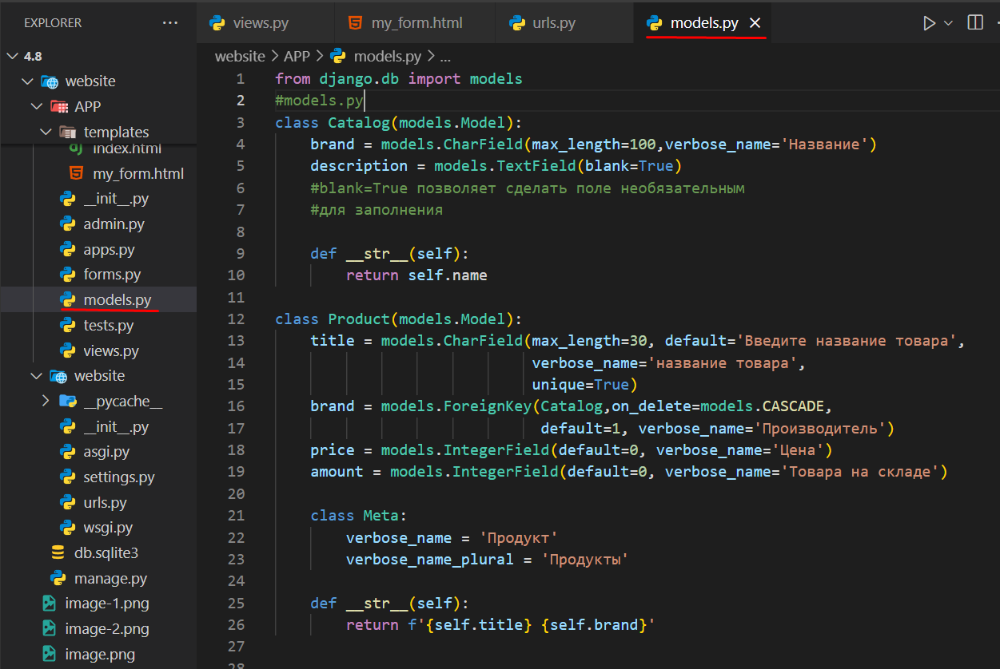

Далее необходимо создать файл forms.py в приложении APP и создать простую форму.

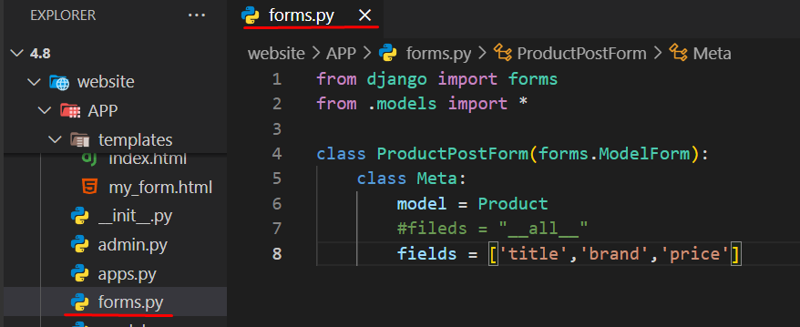

Далее создадим views-функцию.

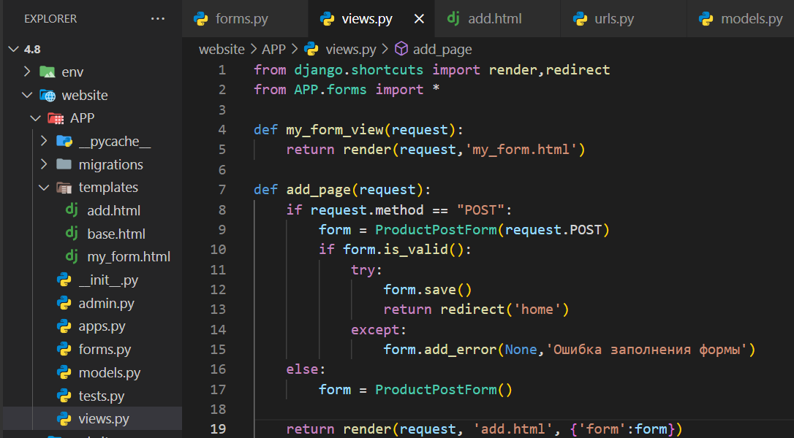

Далее создадим add.html

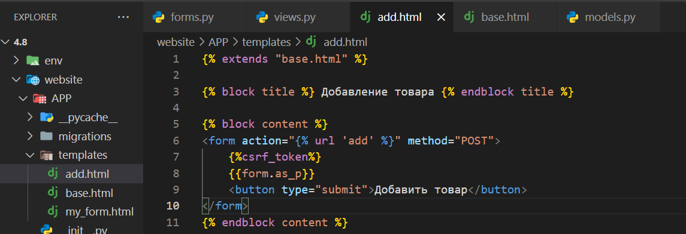

файл base.html:

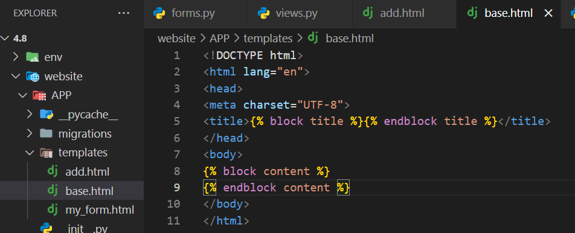

Добавим в urls
```py
#urls
path('', views.add_page)
```
<h2> Home Work </h2>
1) Создать модель Person с следующими полями:

Имя 

Фамилия

2) Создать форму отправки для модели клиента с записьюданных в базу данных.

Решение:

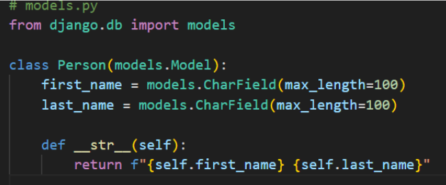

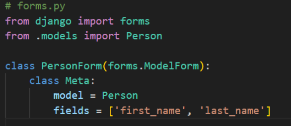

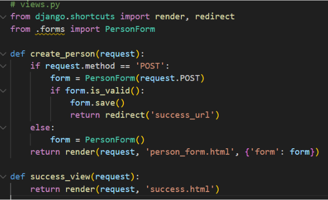

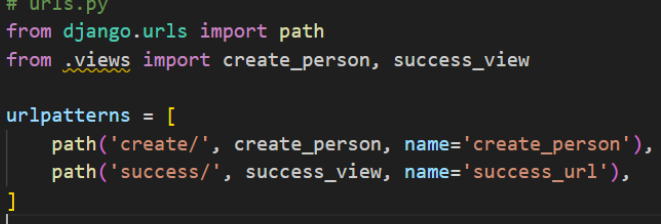