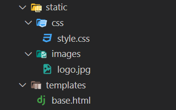
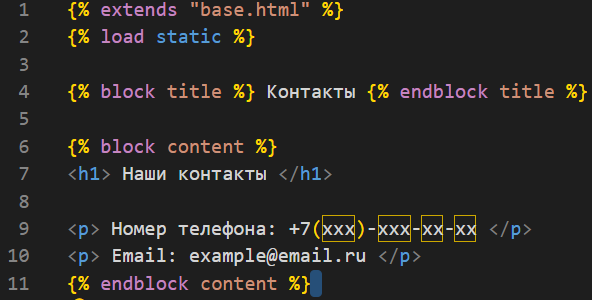

<h1 style="color: green;text-align: center"> Сайт лендинг </h1>

Порядок действий:

Создаем папку для проекта <br>
Устанавливаем venv:<br>
python -m venv venv <br>
Создаем проект и приложение: <br>
django-admin startproject website(имя можно придумать любое по своему вкусу) <br>
django-admin startapp APP <br>

4) Создаём модель клиента для будущей формы <br>
а) Устанавливаем кастомную форму для номера телефона:
```
pip install django-phonenumber-field
pip install phonenumbers
```


б) Создаём модель и выполняем миграции(models.py)


Выполним миграции:

* <span style="color: rgb(55,77,111)"> python manage.py makemigrations</span> 
* <span style="color: rgb(123,145,123)"> python manage.py migrate </span>

5) Создаём базовый шаблон и статик файлы как в проекте ранее и подключаем static



6) Создаем все страницы и views функции по проекту:
base.html


about_us.html


contacts.html


main.html


7) Создаём форму в forms.py


8) views.py


urls.py

9) css стили

```css

body {
    margin: 0;
    padding: 0;
    font-family: Arial, sans-serif;
    background-color: #000000; /* Черный фон */
    color: #fff; /* Белый цвет текста */
    text-align: center;
}

/* Стили для заголовка (header) */
header {
    background-color: #262626;
    text-align: center;
    padding: 20px 0;
    
}

/* Стили для кнопок */
button {
    background-color: #ababab68; /* Черный фон кнопок */
    border: none;
    padding: 10px 20px;
    margin-top: 20px;
    cursor: pointer;
    font-size: 18px;
    border-radius: 5px;
}

/* Стили для кнопок при наведении */
button:hover {
    background-color: #333; /* Черный фон кнопок при наведении */
}

.logo{
    text-align: center;
}


h1, h2, h3, h4, h5, p{
    color: #fff;
}

h1{
    font-size: 30px;
}
h2{
    font-size: 27px;
}
h3{
    font-size: 25px;
}
h4{
    font-size: 23px;
}
h5{
    font-size: 20px;
}

p{
    font-size: 18px;
}

```