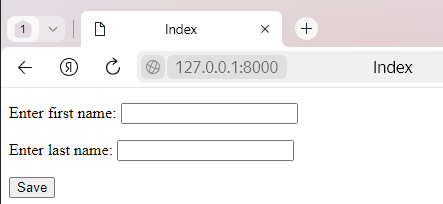
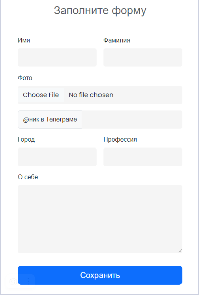
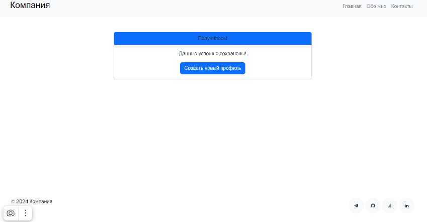
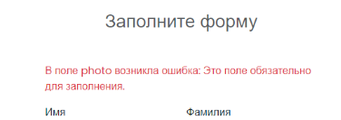

<h1 style="color: red; text-align: center;">Формы в Django </h1>

Веб-формы — это страницы, которые пользователи запрашивают с помощью браузера. Эти страницы могут быть написаны с помощью сочетания HTML, клиентского скрипта, серверных элементов управления и серверного кода. Когда пользователи запрашивают страницу, она компилируется и выполняется на сервере платформой, а затем платформа создает HTML-разметку, которую может отобразить браузер.


Django предоставляет класс Form, который используется для создания HTML-форм. Он описывает форму, ее работу и внешний вид. Он похож на класс ModelForm, который создает форму с помощью модели, но не требует определенной модели.

Каждое поле карты класса Form соответствует элементу HTML-формы < input>, и каждое из них является самим классом, он управляет данными формы и выполняет проверку при отправке формы.

Давайте посмотрим на пример, в котором мы тоже создаем несколько полей.

```py
from django import forms 
class StudentForm(forms.Form): 
    firstname = forms.CharField(label="Enter first name",max_length=50) 
    lastname  = forms.CharField(label="Enter last name", max_length = 100)
```
Создается StudentForm, содержащий два поля типа CharField. <br> Charfield – это класс, который используется для создания компонента ввода текста HTML в форме.

Метка используется для установки HTML-метки компонента, а max_length устанавливает длину входного значения.

При рендеринге он выводит в браузер следующий HTML-код.

```html
<label for="id_firstname">Enter first name:</label> 
<input type="text" name="firstname" required maxlength="50" id="id_firstname" /> 
<label for="id_lastname">Enter last name:</label> 
<input type="text" name="lastname" required maxlength="100" id="id_lastname" />
```
Примечание. Django Form не включает теги или кнопку отправки. Мы должны сами указать их в шаблоне.

<b> Создание формы в Django </b> <br>
Предположим, мы хотим создать форму для получения информации о студенте, используем для этого следующий код.
```py
from django import forms 
class StudentForm(forms.Form): 
    firstname = forms.CharField(label="Enter first name",max_length=50) 
    lastname  = forms.CharField(label="Enter last name", max_length = 100) 
```
Поместите этот код в файл forms.py.

Теперь нам нужно создать экземпляр формы в файле views.py. (См. приведенный ниже код).

```py
from django.shortcuts import render
from APP.forms import StudentForm

def index(request):
    student = StudentForm()
    return render(request, 'index.html', {'form':student})
```

index.html:
```html
<!DOCTYPE html>
<html lang="en">
<head>
    <meta charset="UTF-8">
    <meta name="viewport" content="width=device-width, initial-scale=1.0">
    <title>Index</title>
</head>
<body>
    <form method="POST"> 
        
        {{form.as_p}}
        <button type="submit">Save</button>
    </form>
</body>
</html>
```
Укажем URL-адрес в urls.py

```py
from django.urls import path
from APP import views

urlpatterns = [
    path('index/', views.index),
]
```
Запустите сервер и войдите в форму в браузере по адресу localhost: 8000, и он выдаст следующий результат.



Однако есть и другие варианты вывода для пар <label>/< input>:
```django
{{form.as_table}} отобразит их как ячейки таблицы, заключенные в теги <tr>;
{{form.as_p}} отобразит их заключенными в теги <p>;
{{form.as_ul}} также отобразит их заключенными в теги <li>.
```
<h2 style="color: green; text-align: center"> Создание простой HTML-Формы</h2>

Для создания простой HTML-формы с полями "Имя" и "Номер телефона" и представления (views function) для обработки этой формы с методом GET, следуйте этим шагам:

Шаг 1: Создайте файл my_form.html в директории templates вашего Django-приложения. В этом файле создайте форму:
```html
<!DOCTYPE html>
<html lang="en">
<head>
    <meta charset="UTF-8">
    <meta name="viewport" content="width=device-width, initial-scale=1.0">
    <title>Простая HTML-форма</title>
</head>
<body>
    <h1>Простая HTML-форма</h1>
    <form method="get">
        <label for="name">Имя: </label>
        <input type="text" name="name" id="name">
        <label for="phone">Номер телефона: </label>
        <input type="text" name="phone" id="phone">
        <input type="submit" value="Отправить">
    </form>
</body>
</html>
```
Шаг 2: Создайте views функцию в файле views.py вашего Django-приложения, которая будет отображать эту форму:

```py
def my_form_views(request):
    return render(request,'my_form.html')
```

Шаг 3: Настройте URL-маршрут в файле urls.py вашего приложения для связи views функции с URL:

```py
path('my_form/',views.my_form_views)
```

<h2 style="color: rgb(0,152,116);text-align: center;"> Django формы: основная функциональность </h2>

Модуль Forms в Django берет на себя всю сложную работу, связанную с обработкой пользовательского ввода. Вот его основные возможности:

1. Почти автоматическое создание форм на основе моделей. При этом в форму можно включать только нужные поля модели, а не все сразу.

2. Два основных типа форм forms.Form и forms. <br>ModelForm – первый тип обычно используется для обработки данных, которые не сохраняются в модели, второй применяют для сохранения информации в БД.

3. Вывод формы в шаблоне с помощью тега {{ form }}. У Django гибкий подход к выводу – форму можно рендерить несколькими способами, причем последний метод, как мы увидим позже, предоставляет самые обширные возможности для кастомного дизайна форм с помощью HTML/CSS:
```django
как параграф {{ form.as_p }}
в виде списка {{ form.as_ul }}
в форме таблицы {{ form.as_table }}
по отдельным полям {{ form.name_of_field }}
```
4. Получение и обработка данных из HTML и AJAX-форм, которые не имеют конкретных исходных моделей. Такой подход используется:

для работы с данными, которые не нужно сохранять в базе данных – например, для обработки контактной формы, данные из которой пересылаются на email.
при обработке форм со сложным дизайном.
при работе с AJAX формами, когда данные отправляются на сервер (и приходят с сервера) в фоновом режиме с использованием JavaScript.<br>
5. Валидация полученных с фронтенда данных. При отправке формы данные попадают в объект request. Во view мы берем эти данные через request.POST, создаем экземпляр формы, передав туда данные, и вызываем метод is_valid() для проверки валидности.

6. Сохранение очищенных данных из валидной формы. Очищенные данные из формы можно получить с помощью метода clean(), после чего эти данные можно дополнительно проверить на соответствие нужным критериям и безопасно сохранить в базе данных.

7. Отображение ошибок валидации. Если данные не соответствуют критериям, Django передает в шаблон объект формы и статус валидности. С помощью цикла можно вывести все ошибки списком, либо указать на ошибку рядом с конкретным полем.

<h2> Создание форм в Django </h2>

Начнем с создания формы для получения данных о пользователе. Поскольку эти данные будут сохраняться в БД, нужно определить соответствующую модель:
```py
from django.db import models

class Profile(models.Model):
    first_name = models.CharField(max_length=20)
    last_name = models.CharField(max_length=20)
    photo = models.ImageField(upload_to='photos')
    telegram = models.CharField(max_length=20)
    city = models.CharField(max_length=20)
    profession = models.CharField(max_length=50)
    bio = models.TextField()

    class Meta:
        ordering = ['id']
        verbose_name = 'Профиль'
        verbose_name_plural = 'Профили'

    def __str__(self):
        return f"{self.first_name} {self.last_name}, {self.profession}"
```

Для хранения ссылки на фото мы используем ImageField, поэтому в вашем виртуальном окружении должна быть библиотека Pillow(если не установленно просто введите pip install Pillow). Не забудьте создать и применить миграции, чтобы таблица Profile появилась в базе данных(python manage.py makemigrations, python manage.py migrate).

При выводе формы мы будем использовать все поля модели, поэтому значение fieldsравно_all_:
```py
#forms.py
from django import forms
from .models import Profile

class ProfileForm(forms.ModelForm):
    class Meta:
        model = Profile
        fields = '__all__'
        labels = {
            'first_name': 'Имя',
            'last_name': 'Фамилия',
            'photo': 'Фото',
            'telegram': 'Телеграм',
            'city': 'Город',
            'profession': 'Профессия',
            'bio': 'О себе',
        }
```

Теперь можно написать представление для вывода формы:
```py
from django.shortcuts import render
from .forms import ProfileForm

def profile_view(request):
    form = ProfileForm()
    return render(request, 'profile.html', {'form': form})
```
Маршрут, по которому будет доступна страница:
```py
from django.urls import path
from APP import views

urlpatterns = [
    path('profile/', views.profile_view, name='profile'),
]
```

И шаблон для вывода формы:

```html
<!DOCTYPE html>
<html>
<head>
    <title>Профиль пользователя</title>
</head>
<body>
    <h2>Заполните форму своими данными:</h2>
    <form method="post">
        
        {{ form.as_p }}
        <button type="submit">Сохранить</button>
    </form>
</body>
```

Неказистый внешний вид форм, выведенных с помощью базовых тегов {{ form }} – единственный минус Django Forms. Схематичность разметки связана с тем, что рендеринг формы по умолчанию выполняется с помощью самых базовых HTML-тегов:

```html
<div>
    <label for="id_first_name">Имя:</label>
<input type="text" name="first_name" maxlength="20" required id="id_first_name">
</div>
  <div>
    <label for="id_last_name">Фамилия:</label>
<input type="text" name="last_name" maxlength="20" required id="id_last_name">
</div>
  <div>
    <label for="id_photo">Фото:</label>
<input type="file" name="photo" accept="image/*" required id="id_photo">
</div>
  <div>
    <label for="id_telegram">Телеграм:</label>
<input type="text" name="telegram" maxlength="20" required id="id_telegram">
</div>
  <div>
    <label for="id_city">Город:</label>
<input type="text" name="city" maxlength="20" required id="id_city">
</div>
  <div>
    <label for="id_profession">Профессия:</label>
<input type="text" name="profession" maxlength="50" required id="id_profession">
</div>
  <div>
    <label for="id_bio">О себе:</label>
<textarea name="bio" cols="40" rows="10" required id="id_bio">
</textarea>
</div>
```

В итоге автоматически выведенная форма будет полностью рабочей и функциональной, но не слишком привлекательной. Этот недостаток, однако, очень легко исправить.

<h2 style="color: rgb(60,170,60); text-align: center;"> Как изменить дизайн Django форм </h2>

Придать форме более привлекательный внешний вид можно несколькими способами:

Автоматически – с помощью дополнительного пакета типа django-crispy-forms, который передает в формы стили Bootstrap или Tailwind. Это самый простой, но не самый гибкий метод, к тому же у новых версий django-crispy-forms бывают конфликты с новыми релизами Django.

С помощью уже упомянутого выше кастомного рендеринга {{ form.name_of_field }}, когда поля формы выводятся в шаблоне одно за другим и к ним можно применять любые HTML-теги и CSS-стили.

С использованием метода field.widget.attrs.update() в forms.py, который передает нужные CSS-стили в шаблон внутри формы.

Другой вариант – сделать нужный HTML/CSS дизайн для формы непосредственно в шаблоне. Чтобы Django мог обработать такую форму, в нее надо передать токен , как и в случае рендеринга встроенных форм Django, а если форм на странице несколько – обязательно указать нужные представления в form action:

```html
<div class="col-md-5 col-xl-5 pe-xxl-0">
    <div class="card card-bg hero-header-form">
        <div class="card-body p-4 p-xl-6">
            <h2 class="text-100 text-center">Вход</h2>
            <form action="" method="POST" class="mb-3">
                
                <div class="form-floating mb-3">
                    <input class="form-control input-box form-ensurance-header-control"
                           id="floatingName"
                           type="text"
                           name="username"
                           placeholder="name"/>
                    <label for="floatingName">Логин</label>
                </div>
                <div class="form-floating mb-3">
                    <input class="form-control input-box form-ensurance-header-control"
                           id="floatingPassword"
                           type="password"
                           name="password"
                           placeholder="••••••••"/>
                    <label for="floatingPassword">Пароль</label>
                </div>
                <div class="col-12 d-grid">
                    <button class="btn btn-primary rounded-pill" type="submit">Войти</button>
                </div>
            </form>
        </div>
    </div>
</div>
```
С помощью любого из этих способов можно привести форму в более презентабельный вид.

Mетод field.widget.attrs.update()

С помощью этого метода можно передать любые нужные CSS-стили (кастомные или стандартные Bootstrap'овские) прямо в форму. Добавим Bootstrap-стили в шаблон profile.html:

```html
<!doctype html>
<html lang="ru">
  <head>
    <meta charset="utf-8">
    <meta name="viewport" content="width=device-width, initial-scale=1">
    <link href="https://cdn.jsdelivr.net/npm/bootstrap@5.2.3/dist/css/bootstrap.min.css" rel="stylesheet">
    <title>Профиль пользователя</title>
  </head>
  <body>
    <nav class="navbar navbar-expand-lg bg-light">
      <div class="container-fluid">
        <a class="navbar-brand" href="#">Компания</a>
        <button class="navbar-toggler" type="button" data-bs-toggle="collapse" data-bs-target="#navbarNav" aria-controls="navbarNav" aria-expanded="false" aria-label="Toggle navigation">
          <span class="navbar-toggler-icon"></span>
        </button>
        <div class="collapse navbar-collapse" id="navbarNav">
          <ul class="navbar-nav ms-auto me-5">
            <li class="nav-item">
              <a class="nav-link active" aria-current="page" href="#">Главная</a>
            </li>
            <li class="nav-item">
              <a class="nav-link" href="#">О нас</a>
            </li>
            <li class="nav-item">
              <a class="nav-link" href="#">Контакты</a>
            </li>
          </ul>
        </div>
      </div>
    </nav>
    <div class="container">
      <div class="row">
        <div class="col-md-4 offset-md-4">
              <h4 class="text-center text-muted">Заполните форму своими данными:</h4>
    <form method="post">
        
        {{ form.as_p }}
        <button type="submit" class="btn btn-primary btn-lg w-100">Сохранить</button>
    </form>
        </div>
      </div>
    </div>
    <footer class="bg-light text-center text-lg-start mt-5">
      <div class="text-center p-3" style="background-color: rgba(0, 0, 0, 0.05);">
        © 2022 Компания
      </div>
    </footer>    
  </body>
</html>
```
И воспользуемся методом field.widget.attrs.update() для передачи стилей form-control и form-label в форму:

```py
#forms.py
from django import forms
from .models import Profile

class ProfileForm(forms.ModelForm):
    class Meta:
        model = Profile
        fields = '__all__'
        labels = {
            'first_name': 'Имя',
            'last_name': 'Фамилия',
            'photo': 'Фото',
            'telegram': 'Телеграм',
            'city': 'Город',
            'profession': 'Профессия',
            'bio': 'О себе',
        }
    
    def __init__(self, *args, **kwargs):
        super(ProfileForm, self).__init__(*args, **kwargs)

        for name, field in self.fields.items():
            field.widget.attrs.update({'class': 'form-control form-label'}) 
```

Кастомный рендеринг форм

Вывод полей формы с помощью тега {{ form.name_of_field }} позволяет встроить Django-форму в более сложный дизайн – когда у каждого поля свой набор стилей.

Предположим, что наша форма должна выглядеть так:


Метод field.widget.attrs.update() в этом случае – не самое оптимальное решение, так у этой формы не только поля, но и оборачивающие эти поля div'ы имеют разные стили:
```html
<form>
  <div class="row g-3">
    <div class="col-md-6">
      <label for="firstName" class="form-label">Имя</label>
      <input type="text" class="form-control" id="firstName">
    </div>
    <div class="col-md-6">
      <label for="lastName" class="form-label">Фамилия</label>    
      <input type="text" class="form-control" id="lastName">
    </div>
  </div>
  <div class="mt-3 mb-3">
    <label for="photo" class="form-label">Фото профиля</label>
    <input class="form-control" type="file" id="photo">
  </div>
  <div class="input-group mb-3">
    <span class="input-group-text">@</span>
    <input type="text" class="form-control" placeholder="Телеграм" id="telegram">
  </div>
  <div class="row g-3">
    <div class="col-md-6">
      <label for="city" class="form-label">Город</label>
      <input type="text" class="form-control" id="city">
    </div>
    <div class="col-md-6">
      <label for="profession" class="form-label">Профессия</label>
      <input type="text" class="form-control" id="profession"> 
    </div>
  </div>
  <div class="mt-3 mb-3">
    <label for="about" class="form-label">О себе</label>
    <textarea class="form-control" placeholder="Расскажите о себе" id="about" rows="4"></textarea>
  </div>
  <button type="submit" class="btn btn-primary btn-lg w-100">Сохранить</button>
</form>
```

Лучшее решение – комбинированное использование field.widget.attrs.update() для передачи стилей form-control в forms.py и {{ form.name_of_field }} в шаблоне profile.html для вывода полей формы по отдельности:

forms.py
```py
from django import forms
from .models import Profile

class ProfileForm(forms.ModelForm):
    class Meta:
        model = Profile
        fields = '__all__'
        labels = {
            'first_name': 'Имя',
            'last_name': 'Фамилия',
            'photo': 'Фото',
            'telegram': 'Телеграм',
            'city': 'Город',
            'profession': 'Профессия',
            'bio': 'О себе',
        }


    def __init__(self, *args, **kwargs):
        super(ProfileForm, self).__init__(*args, **kwargs)

        for name, field in self.fields.items():
            field.widget.attrs.update({'class': 'form-control'}) 
```

base.html
```html

<!DOCTYPE html>
<html lang="ru">
   <head>
      <meta charset="utf-8">
      <meta content="width=device-width, initial-scale=1.0" name="viewport">
      <title>Создать профиль</title>
      <meta content="" name="description">
      <meta content="" name="keywords">
      <link rel="shortcut icon" href="">
      <link rel="preconnect" href="https://fonts.googleapis.com">
      <link rel="preconnect" href="https://fonts.gstatic.com" crossorigin>
      <link href="https://fonts.googleapis.com/css2?family=Poppins&display=swap" rel="stylesheet">
      <link href="" rel="stylesheet">
      <link href='https://unpkg.com/boxicons@2.1.4/css/boxicons.min.css' rel='stylesheet'>
      <link href="" rel="stylesheet">
   </head>
   <body>
      <nav class="navbar navbar-expand-lg navbar-light bg-light">
         <div class="container-fluid">
            <a class="navbar-brand ms-5" href="">
               <h3>Компания</h3>
            </a>
            <button class="navbar-toggler" type="button" data-bs-toggle="collapse" data-bs-target="#navbarNav" aria-controls="navbarNav" aria-expanded="false" aria-label="Toggle navigation">
            <span class="navbar-toggler-icon"></span>
            </button>
            <div class="collapse navbar-collapse" id="navbarNav">
               <ul class="navbar-nav ms-auto me-5">
                  <li class="nav-item">
                     <a class="nav-link" href="">Главная</a>
                  </li>
                  <li class="nav-item">
                     <a class="nav-link" href="">Обо мне</a>
                  </li>
                  <li class="nav-item">
                     <a class="nav-link" href="">Контакты</a>
                  </li>
               </ul>
            </div>
         </div>
      </nav>
      <main id="main" class="content">
         
      </main>
      <footer class="footer" role="contentinfo">
         <div class="container">
            <div class="row">
               <div class="col-sm-6">
                  <p class="mb-1">&copy;  Компания</p>
               </div>
               <div class="col-sm-6 social text-md-end">
                  <a href="#"><span class="bx bxl-telegram"></span></a>
                  <a href="#"><span class="bx bxl-github"></span></a>
                  <a href="#"><span class="bx bxl-stack-overflow"></span></a>
                  <a href="#"><span class="bx bxl-linkedin"></span></a>
               </div>
            </div>
         </div>
      </footer>
      <a href="#" class="back-to-top d-flex align-items-center justify-content-center"><i class="bi bi-arrow-up-short"></i></a>
   </body>
</html>
```
profile.html
```html


<div class="container">
   <div class="row">
      <div class="col-md-4 offset-md-4">
         <h3 class="text-center mt-5 mb-5 text-muted">Заполните форму</h3>
         <form method="post" enctype="multipart/form-data">
            
            
            <ul class="list-unstyled">
               
               <li class="text-danger">{{ message }}</li>
               
            </ul>
            
            <div class="row g-3">
               <div class="col-md-6">
                  <label for="{{ form.first_name.auto_id }}" class="form-label">{{ form.first_name.label }}</label>
                  {{ form.first_name }}
               </div>
               <div class="col-md-6">
                  <label for="{{ form.last_name.auto_id }}" class="form-label">{{ form.last_name.label }}</label>    
                  {{ form.last_name }}
               </div>
            </div>
            <div class="mt-3 mb-3">
               <label for="{{ form.photo.auto_id }}" class="form-label">{{ form.photo.label }}</label>
               {{ form.photo }}
            </div>
            <div class="input-group mb-3">
               <span class="input-group-text">@ник в Телеграме</span>
               {{ form.telegram }}
            </div>
            <div class="row g-3">
               <div class="col-md-6">
                  <label for="{{ form.city.auto_id }}" class="form-label">{{ form.city.label }}</label>
                  {{ form.city }}
               </div>
               <div class="col-md-6">
                  <label for="{{ form.profession.auto_id }}" class="form-label">{{ form.profession.label }}</label>
                  {{ form.profession }}
               </div>
            </div>
            <div class="mt-3 mb-3">
               <label for="{{ form.bio.auto_id }}" class="form-label">{{ form.bio.label }}</label>
               {{ form.bio }}
            </div>
            <button type="submit" class="btn btn-primary btn-lg w-100 mt-3 mb-5">Сохранить</button>
         </form>
      </div>
   </div>
</div>

```
success.html
```html


    <div class="container mt-5">
        <div class="row justify-content-center">
            <div class="col-md-6">
                <div class="card text-center">
                    <div class="card-header bg-primary">
                        Получилось!
                    </div>
                    <div class="card-body">
                        <p class="card-text">Данные успешно сохранены!</p>
                        <a href="" class="btn btn-primary">Создать новый профиль</a>
                    </div>
                </div>
            </div>
        </div>
    </div>

```
Для сохранения данных из формы в модели напишем представление ProfileFormView, а для вывода сообщения об успешном сохранении данных – представление SuccessView:
views.py
```py
from django.views.generic.edit import FormView
from django.views.generic import TemplateView
from .forms import ProfileForm
from django.urls import reverse_lazy
from django.contrib import messages


class SuccessView(TemplateView):
    template_name = 'success.html'

class ProfileFormView(FormView):
    form_class = ProfileForm
    template_name = 'profile.html'
    success_url = reverse_lazy('success')

    def form_valid(self, form):
        profile = form.save()
        return super().form_valid(form)

    def form_invalid(self, form):
        for field, errors in form.errors.items():
            for error in errors:
                messages.error(self.request, f'В поле {field} возникла ошибка: {error}')
        return super().form_invalid(form)
```
Эти представления приводятся в действие маршрутами profile/ и success/:
urls.py
```py
from django.urls import path
from APP import views

urlpatterns = [
    path('profile/', views.ProfileFormView.as_view(), name='profile'),
    path('success/', views.SuccessView.as_view(), name='success'),
]
```

Если с данными в форме все в порядке, они будут сохранены в БД, а пользователь будет перенаправлен на success.html:

Если же пользователь заполнил форму неправильно, он увидит сообщение об ошибке в конкретном поле формы:

Важно!
Чтобы Django смог получить файл из формы, в этой форме (помимо токена) обязательно должен быть указан атрибут enctype="multipart/form-data".

В верхней части формы в шаблоне profile.html определен вывод возможных ошибок:
```html
<form method="post" enctype="multipart/form-data">
    
    
    <ul class="list-unstyled">
       
       <li>  class="text-danger">{{ message }}</li>
       
    </ul>
    
    <div class="row g-3">
       <div class="col-md-6">
          <label for="{{ form.first_name.auto_id }}" class="form-label">{{ form.first_name.label }}</label>
          {{ form.first_name }}
       </div>
       <div class="col-md-6">
          <label for="{{ form.last_name.auto_id }}" class="form-label">{{ form.last_name.label }}</label>    
          {{ form.last_name }}
       </div>
    </div>
    <div class="mt-3 mb-3">
       <label for="{{ form.photo.auto_id }}" class="form-label">{{ form.photo.label }}</label>
       {{ form.photo }}
    </div>
    <div class="input-group mb-3">
       <span class="input-group-text">@ник в Телеграме</span>
       {{ form.telegram }}
    </div>
    <div class="row g-3">
       <div class="col-md-6">
          <label for="{{ form.city.auto_id }}" class="form-label">{{ form.city.label }}</label>
          {{ form.city }}
       </div>
       <div class="col-md-6">
          <label for="{{ form.profession.auto_id }}" class="form-label">{{ form.profession.label }}</label>
          {{ form.profession }}
       </div>
    </div>
    <div class="mt-3 mb-3">
       <label for="{{ form.bio.auto_id }}" class="form-label">{{ form.bio.label }}</label>
       {{ form.bio }}
    </div>
    <button type="submit" class="btn btn-primary btn-lg w-100 mt-3 mb-5">Сохранить</button>
 </form>
```
