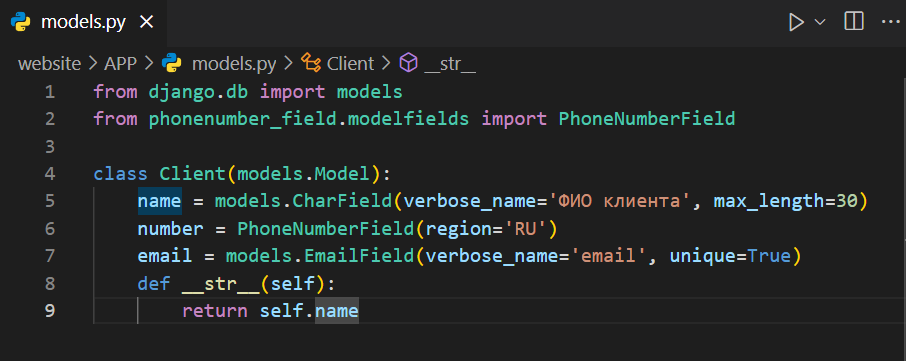
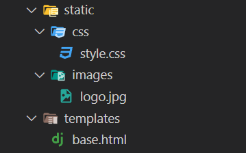
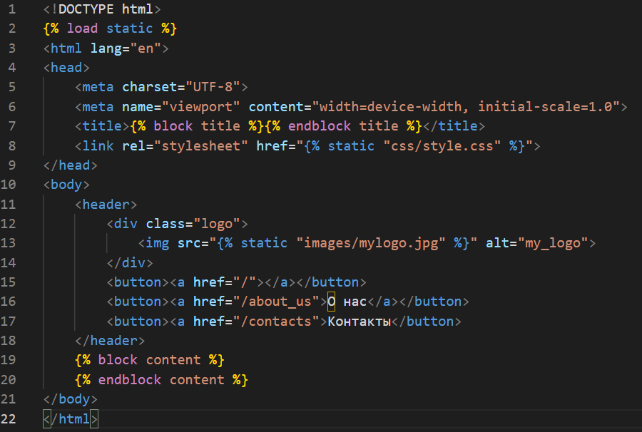
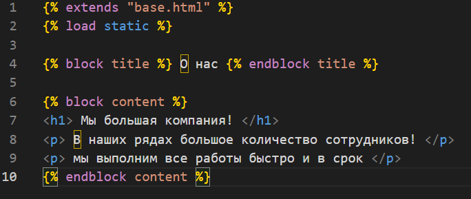
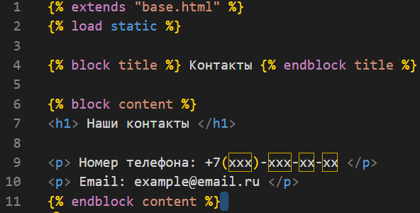
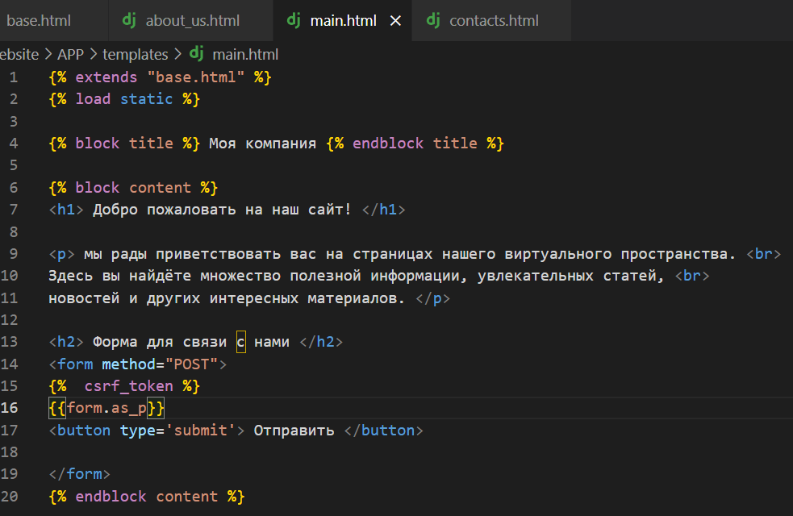
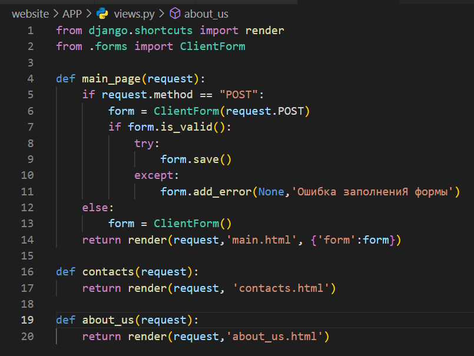
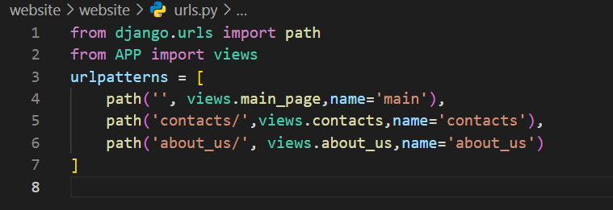

<h1 style="color: green;text-align: center"> Сайт лендинг </h1>

Порядок действий:

Создаем папку для проекта <br>
Устанавливаем venv:<br>
python -m venv env <br>
активируем окружение env/Scripts/activate <br>
Установка Django - pip install Django <br>
Создаем проект и приложение: <br>
django-admin startproject website(имя можно придумать любое по своему вкусу) <br>
перейдя в папку проекта(cd ./website), установим приложение
django-admin startapp APP <br>
Выполним миграции: python manage.py migrate <br>

4) Создаём модель клиента для будущей формы <br>
а) Устанавливаем кастомную форму для номера телефона:
```
pip install django-phonenumber-field
pip install phonenumbers
```


б) Создаём модель и выполняем миграции(models.py)


Выполним миграции:

* <span style="color: rgb(55,77,111)"> python manage.py makemigrations</span> 
* <span style="color: rgb(123,145,123)"> python manage.py migrate </span>

5) Создаём базовый шаблон и статик файлы как в проекте ранее и подключаем static



6) Создаем все страницы и views функции по проекту: <br>
base.html



about_us.html


contacts.html


main.html


7) Создаём форму в forms.py


8) views.py



urls.py


9) css стили

```css

body {
    margin: 0;
    padding: 0;
    font-family: Arial, sans-serif;
    background-color: #000000; /* Черный фон */
    color: #fff; /* Белый цвет текста */
    text-align: center;
}

/* Стили для заголовка (header) */
header {
    background-color: #262626;
    text-align: center;
    padding: 20px 0;
    
}

/* Стили для кнопок */
button {
    background-color: #ababab68; /* Черный фон кнопок */
    border: none;
    padding: 10px 20px;
    margin-top: 20px;
    cursor: pointer;
    font-size: 18px;
    border-radius: 5px;
}

/* Стили для кнопок при наведении */
button:hover {
    background-color: #333; /* Черный фон кнопок при наведении */
}

.logo{
    text-align: center;
}


h1, h2, h3, h4, h5, p{
    color: #fff;
}

h1{
    font-size: 30px;
}
h2{
    font-size: 27px;
}
h3{
    font-size: 25px;
}
h4{
    font-size: 23px;
}
h5{
    font-size: 20px;
}

p{
    font-size: 18px;
}

@keyframes leaf-odd-grow {
    0% {
      transform: scale(0);
    }
    100% {
      transform: scale(1);
    }
  }
  
  @keyframes leaf-even-grow {
    0% {
      transform: rotate(-90deg) scale(0);
    }
    100% {
      transform: rotate(-90deg) scale(1);
    }
  }
  
  html, body {
    margin: 0;
    padding: 0;
  }
  
  .canvas {
    display: flex;
    justify-content: center;
    align-items: center;
    width: 100%;
    min-height: 600px;
  
    background-color: #d1cee0;
  }
  
  .trunk,
  .branch {
    border-radius: 25px;
    background: linear-gradient(to right, #7f3333, #4d2020);
  }
  
  .trunk {
    position: relative;
    
    width: 10px;
    height: 500px;
    margin: 0 auto;
  }
  
  .branch {
    position: absolute;
    
    width: 5px;
    
    transform-origin: bottom center;
  }
  
  .branch:nth-child(even) {
    transform: rotate(60deg);
  }
  
  .branch:nth-child(odd) {
    transform: rotate(-60deg);
  }
  
  .branch:nth-child(1) {
    top: 180px;
    
    height: 180px;
  }
  
  .branch:nth-child(2) {
    top: 160px;
  
    height: 150px;
  }
  
  .branch:nth-child(3) {
    top: 120px;
    
    height: 150px;
  }
  
  .branch:nth-child(4) {
    top: 100px;
    
    height: 120px;
  }
  
  .branch:nth-child(5) {
    top: 60px;
    
    height: 120px;
  }
  
  .branch:nth-child(6) {
    top: 55px;
    
    height: 80px;
  }
  
  .branch:nth-child(7) {
    top: 10px;
    
    height: 80px;
  }
  
  .branch:nth-child(8) {
    top: 5px;
    
    height: 40px;
  }
  
  .leaf {
    position: absolute;
    
    width: 15px;
    height: 15px;
    
    border-radius: 75% 0 75% 0;
    background: linear-gradient(to right, #77ed9e, #53ad71);
  }
  
  .leaf:nth-child(odd) {
    left: 100%;
    
    transform-origin: 0% 100%;
    animation-name: leaf-odd-grow;
    animation-duration: 4s;
    animation-fill-mode: both;
  }
  
  .leaf:nth-child(even) {  
    left: -150%;
    
    transform-origin: 50% 100%;
    animation-name: leaf-even-grow;
    animation-duration: 4s;
    animation-fill-mode: both;
  }
  
  .leaf:nth-child(1) {
    top: 5px;
    
    animation-delay: 3.5s;
  }
  
  .leaf:nth-child(2) {
    top: 20px;
    
    animation-delay: 3s;
  }
  
  .leaf:nth-child(3) {
    top: 50px;
    
    animation-delay: 2.5s;
  }
  
  .leaf:nth-child(4) {
    top: 65px;
    
    animation-delay: 2s;
  }
  
  .leaf:nth-child(5) {
    top: 95px;
    
    animation-delay: 1.5s;
  }
  
  .leaf:nth-child(6) {
    top: 110px;
    
    animation-delay: 1s;
  }
  
  .leaf:nth-child(7) {
    top: 140px;
    
    animation-delay: 0.5s;
  }
```

base.html с деревом:

```html
<!DOCTYPE html>

<html lang="en">
<head>
    <meta charset="UTF-8">
    <meta name="viewport" content="width=device-width, initial-scale=1.0">
    <title></title>
    <link rel="stylesheet" href="">
</head>
<body>
    <header>
    <div class="logo">
    
    </div>
    <button><a href="/">Главная</a></button>
    <button><a href="/about_us">О нас</a></button>
    <button><a href="/contacts">Контакты</a></button>
    </header>
    <div class="content">
    <div class="dj_content">
    
    
    </div>
    <div class="canvas">
        <div class="tree">
          <div class="trunk">
            <div class="branch">
              <div class="leaf"></div>
              <div class="leaf"></div>
              <div class="leaf"></div>
              <div class="leaf"></div>
              <div class="leaf"></div>
              <div class="leaf"></div>
              <div class="leaf"></div>
            </div>
            <div class="branch">
              <div class="leaf"></div>
              <div class="leaf"></div>
              <div class="leaf"></div>
              <div class="leaf"></div>
              <div class="leaf"></div>
              <div class="leaf"></div>
            </div>
            <div class="branch">
              <div class="leaf"></div>
              <div class="leaf"></div>
              <div class="leaf"></div>
              <div class="leaf"></div>
              <div class="leaf"></div>
              <div class="leaf"></div>
            </div>
            <div class="branch">
              <div class="leaf"></div>
              <div class="leaf"></div>
              <div class="leaf"></div>
              <div class="leaf"></div>
              <div class="leaf"></div>
            </div>
            <div class="branch">
              <div class="leaf"></div>
              <div class="leaf"></div>
              <div class="leaf"></div>
              <div class="leaf"></div>
              <div class="leaf"></div>
            </div>
            <div class="branch">
              <div class="leaf"></div>
              <div class="leaf"></div>
              <div class="leaf"></div>
            </div>
            <div class="branch">
              <div class="leaf"></div>
              <div class="leaf"></div>
              <div class="leaf"></div>
            </div>
            <div class="branch">
              <div class="leaf"></div>
            </div>
          </div>
        </div>
      </div>
    </div>
</body>
</html>
```